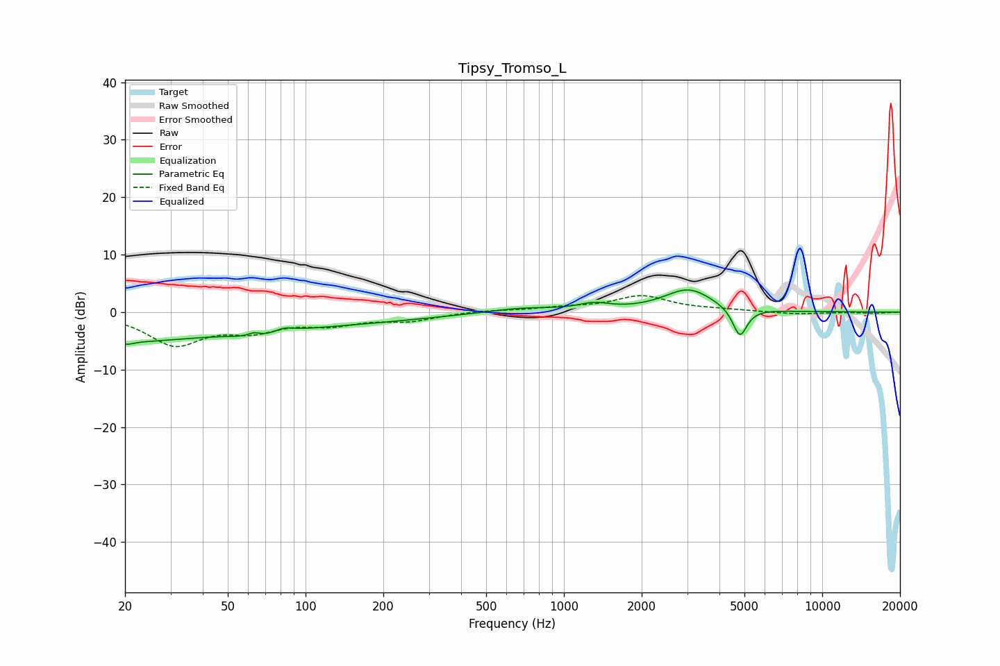

# Tipsy_Tromso_L
See [usage instructions](https://github.com/jaakkopasanen/AutoEq#usage) for more options and info.

### Parametric EQs
Apply preamp of -3.9 dB when using parametric equalizer.

|   # | Type    |   Fc (Hz) |    Q |   Gain (dB) |
|-----|---------|-----------|------|-------------|
|   1 | Peaking |        20 | 0.54 |        -3.9 |
|   2 | Peaking |        20 | 4.75 |        -0.7 |
|   3 | Peaking |        63 | 5.91 |         0.8 |
|   4 | Peaking |        66 | 1.64 |        -1.2 |
|   5 | Peaking |        83 | 3.8  |         0.8 |
|   6 | Peaking |        84 | 0.29 |        -2.2 |
|   7 | Peaking |       685 | 1.03 |         0.8 |
|   8 | Peaking |      1308 | 2.39 |         1.1 |
|   9 | Peaking |      3040 | 1.48 |         4   |
|  10 | Peaking |      4799 | 5.04 |        -5.2 |

### Fixed Band EQs
When using fixed band (also called graphic) equalizer, apply preamp of **-3.0 dB** (if available) and set gains manually with these parameters.

|   # | Type    |   Fc (Hz) |    Q |   Gain (dB) |
|-----|---------|-----------|------|-------------|
|   1 | Peaking |        31 | 1.41 |        -5.4 |
|   2 | Peaking |        62 | 1.41 |        -2.7 |
|   3 | Peaking |       125 | 1.41 |        -1.8 |
|   4 | Peaking |       250 | 1.41 |        -1.4 |
|   5 | Peaking |       500 | 1.41 |         0.3 |
|   6 | Peaking |      1000 | 1.41 |         0.6 |
|   7 | Peaking |      2000 | 1.41 |         2.7 |
|   8 | Peaking |      4000 | 1.41 |         0.3 |
|   9 | Peaking |      8000 | 1.41 |        -0.4 |
|  10 | Peaking |     16000 | 1.41 |        -0.2 |

### Graphs

