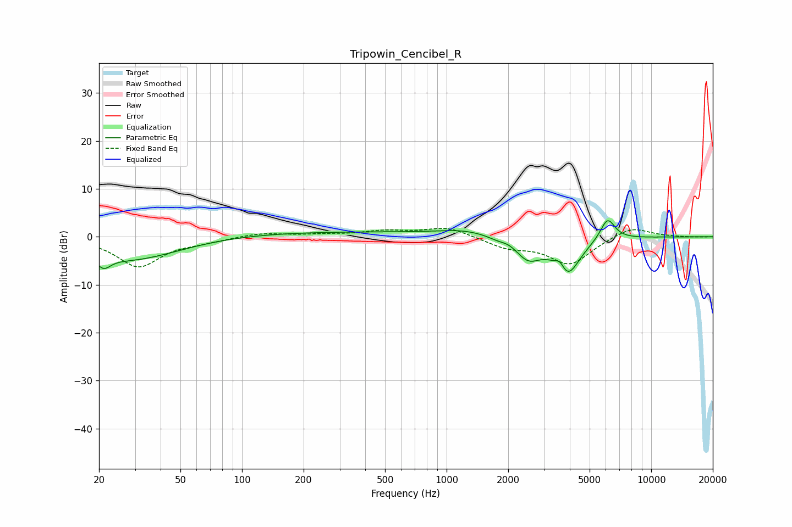

# Tripowin_Cencibel_R
See [usage instructions](https://github.com/jaakkopasanen/AutoEq#usage) for more options and info.

### Parametric EQs
Apply preamp of -3.4 dB when using parametric equalizer.

|   # | Type    |   Fc (Hz) |    Q |   Gain (dB) |
|-----|---------|-----------|------|-------------|
|   1 | Peaking |        21 | 4.25 |        -2.4 |
|   2 | Peaking |        29 | 0.56 |        -5.1 |
|   3 | Peaking |       191 | 0.18 |         1.1 |
|   4 | Peaking |      1234 | 1.04 |         1.2 |
|   5 | Peaking |      1825 | 2.66 |        -0.7 |
|   6 | Peaking |      1990 | 4.11 |         0.5 |
|   7 | Peaking |      2507 | 2.32 |        -4.1 |
|   8 | Peaking |      3587 | 6    |         2.1 |
|   9 | Peaking |      3881 | 2.29 |        -7.9 |
|  10 | Peaking |      6122 | 3.79 |         4.7 |

### Fixed Band EQs
When using fixed band (also called graphic) equalizer, apply preamp of **-1.8 dB** (if available) and set gains manually with these parameters.

|   # | Type    |   Fc (Hz) |    Q |   Gain (dB) |
|-----|---------|-----------|------|-------------|
|   1 | Peaking |        31 | 1.41 |        -6.2 |
|   2 | Peaking |        62 | 1.41 |        -0.8 |
|   3 | Peaking |       125 | 1.41 |         0.8 |
|   4 | Peaking |       250 | 1.41 |         0.4 |
|   5 | Peaking |       500 | 1.41 |         1.1 |
|   6 | Peaking |      1000 | 1.41 |         2   |
|   7 | Peaking |      2000 | 1.41 |        -2.1 |
|   8 | Peaking |      4000 | 1.41 |        -5.7 |
|   9 | Peaking |      8000 | 1.41 |         2.3 |
|  10 | Peaking |     16000 | 1.41 |        -0.1 |

### Graphs

