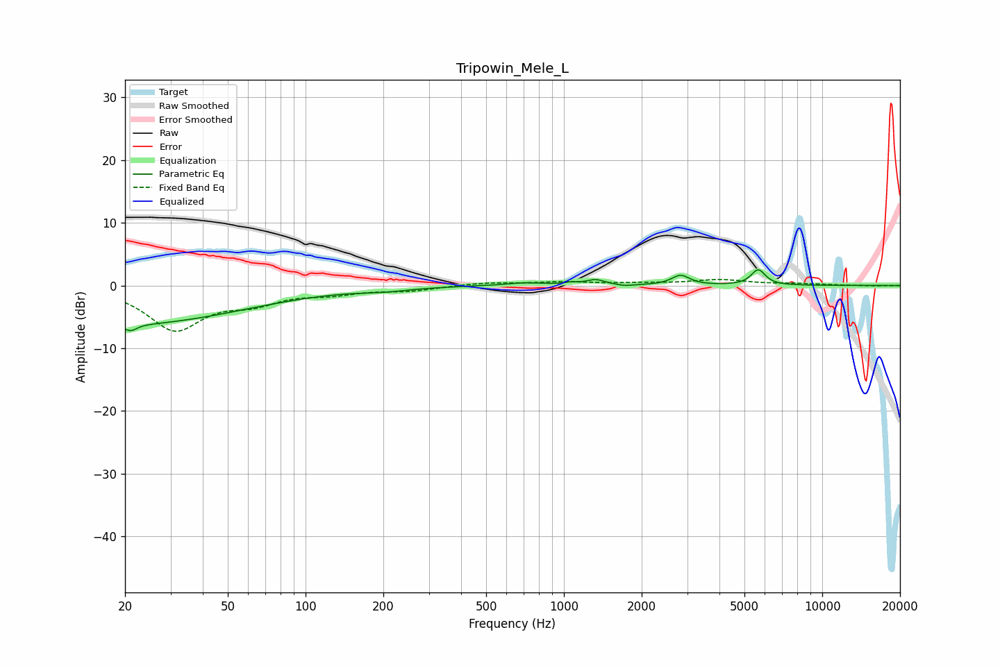

# Tripowin_Mele_L
See [usage instructions](https://github.com/jaakkopasanen/AutoEq#usage) for more options and info.

### Parametric EQs
Apply preamp of -2.6 dB when using parametric equalizer.

|   # | Type    |   Fc (Hz) |    Q |   Gain (dB) |
|-----|---------|-----------|------|-------------|
|   1 | Peaking |        20 | 0.3  |        -6.2 |
|   2 | Peaking |        21 | 5.93 |        -1.1 |
|   3 | Peaking |       202 | 1.47 |        -0.5 |
|   4 | Peaking |       708 | 1.9  |         0.5 |
|   5 | Peaking |      1063 | 5.97 |         0.3 |
|   6 | Peaking |      1326 | 4.03 |         0.9 |
|   7 | Peaking |      1723 | 4.98 |        -0.2 |
|   8 | Peaking |      2826 | 5.06 |        -0.3 |
|   9 | Peaking |      2829 | 4.28 |         1.9 |
|  10 | Peaking |      5654 | 5.15 |         2.5 |

### Fixed Band EQs
When using fixed band (also called graphic) equalizer, apply preamp of **-1.1 dB** (if available) and set gains manually with these parameters.

|   # | Type    |   Fc (Hz) |    Q |   Gain (dB) |
|-----|---------|-----------|------|-------------|
|   1 | Peaking |        31 | 1.41 |        -6.8 |
|   2 | Peaking |        62 | 1.41 |        -2.2 |
|   3 | Peaking |       125 | 1.41 |        -1   |
|   4 | Peaking |       250 | 1.41 |        -0.7 |
|   5 | Peaking |       500 | 1.41 |         0.5 |
|   6 | Peaking |      1000 | 1.41 |         0.5 |
|   7 | Peaking |      2000 | 1.41 |         0.3 |
|   8 | Peaking |      4000 | 1.41 |         0.9 |
|   9 | Peaking |      8000 | 1.41 |         0.2 |
|  10 | Peaking |     16000 | 1.41 |        -0.1 |

### Graphs

