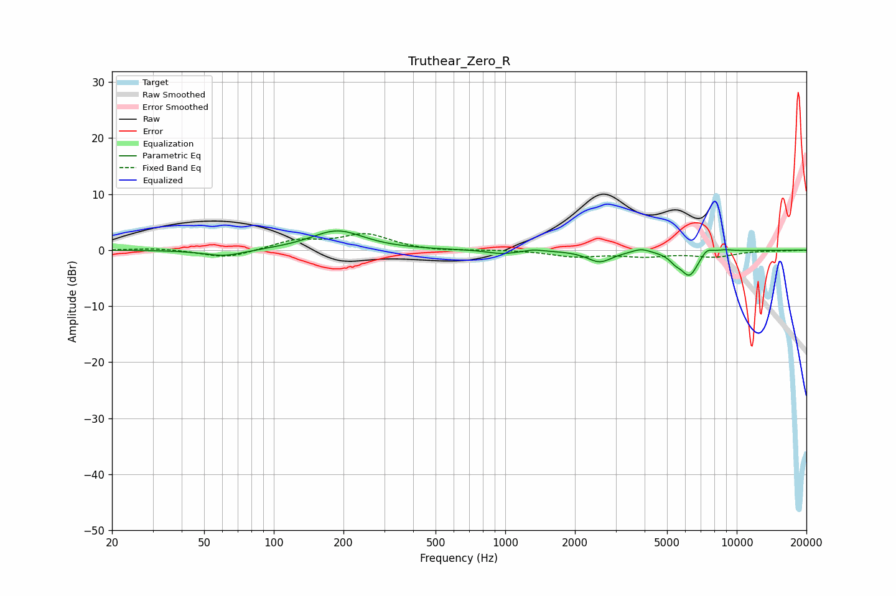

# Truthear_Zero_R
See [usage instructions](https://github.com/jaakkopasanen/AutoEq#usage) for more options and info.

### Parametric EQs
Apply preamp of -3.5 dB when using parametric equalizer.

|   # | Type    |   Fc (Hz) |    Q |   Gain (dB) |
|-----|---------|-----------|------|-------------|
|   1 | Peaking |        61 | 1.57 |        -1.2 |
|   2 | Peaking |       188 | 1.24 |         3.5 |
|   3 | Peaking |       969 | 2.3  |        -0.7 |
|   4 | Peaking |      1325 | 4.04 |         0.3 |
|   5 | Peaking |      2559 | 2.64 |        -2.1 |
|   6 | Peaking |      3867 | 3.89 |         0.7 |
|   7 | Peaking |      5426 | 5.52 |        -1   |
|   8 | Peaking |      6253 | 3.58 |        -4.5 |
|   9 | Peaking |      7416 | 5.15 |         1.2 |
|  10 | Peaking |      8773 | 3.44 |         0.3 |

### Fixed Band EQs
When using fixed band (also called graphic) equalizer, apply preamp of **-3.0 dB** (if available) and set gains manually with these parameters.

|   # | Type    |   Fc (Hz) |    Q |   Gain (dB) |
|-----|---------|-----------|------|-------------|
|   1 | Peaking |        31 | 1.41 |         0.4 |
|   2 | Peaking |        62 | 1.41 |        -1.5 |
|   3 | Peaking |       125 | 1.41 |         1.7 |
|   4 | Peaking |       250 | 1.41 |         2.7 |
|   5 | Peaking |       500 | 1.41 |        -0.3 |
|   6 | Peaking |      1000 | 1.41 |         0.1 |
|   7 | Peaking |      2000 | 1.41 |        -1.1 |
|   8 | Peaking |      4000 | 1.41 |        -1   |
|   9 | Peaking |      8000 | 1.41 |        -1.1 |
|  10 | Peaking |     16000 | 1.41 |        -0.1 |

### Graphs

