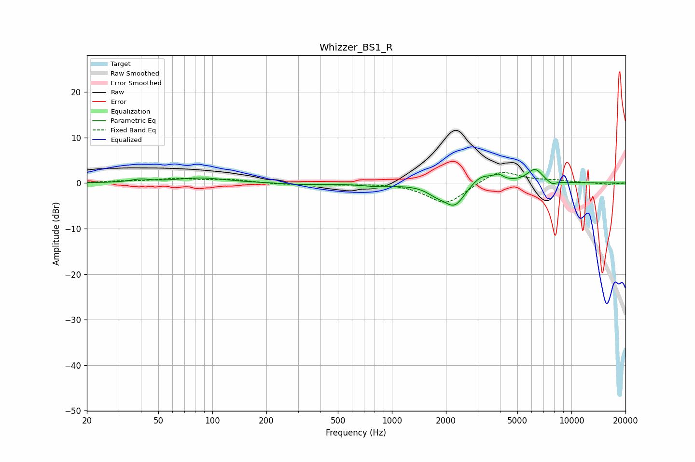

# Whizzer_BS1_R
See [usage instructions](https://github.com/jaakkopasanen/AutoEq#usage) for more options and info.

### Parametric EQs
Apply preamp of -3.1 dB when using parametric equalizer.

|   # | Type    |   Fc (Hz) |    Q |   Gain (dB) |
|-----|---------|-----------|------|-------------|
|   1 | Peaking |        40 | 2.82 |         0.6 |
|   2 | Peaking |        86 | 1.03 |         1.1 |
|   3 | Peaking |       321 | 1.33 |        -0.3 |
|   4 | Peaking |       836 | 1.52 |        -0.6 |
|   5 | Peaking |      1755 | 2.71 |        -1.3 |
|   6 | Peaking |      2236 | 2.28 |        -5.2 |
|   7 | Peaking |      3152 | 2.05 |         2.5 |
|   8 | Peaking |      3939 | 5.59 |         1.1 |
|   9 | Peaking |      6258 | 3.17 |         3   |
|  10 | Peaking |      7771 | 5.1  |        -0.9 |

### Fixed Band EQs
When using fixed band (also called graphic) equalizer, apply preamp of **-2.4 dB** (if available) and set gains manually with these parameters.

|   # | Type    |   Fc (Hz) |    Q |   Gain (dB) |
|-----|---------|-----------|------|-------------|
|   1 | Peaking |        31 | 1.41 |         0.3 |
|   2 | Peaking |        62 | 1.41 |         0.9 |
|   3 | Peaking |       125 | 1.41 |         0.7 |
|   4 | Peaking |       250 | 1.41 |        -0.3 |
|   5 | Peaking |       500 | 1.41 |        -0.3 |
|   6 | Peaking |      1000 | 1.41 |         0.1 |
|   7 | Peaking |      2000 | 1.41 |        -4.7 |
|   8 | Peaking |      4000 | 1.41 |         3   |
|   9 | Peaking |      8000 | 1.41 |         0.5 |
|  10 | Peaking |     16000 | 1.41 |        -0.3 |

### Graphs

