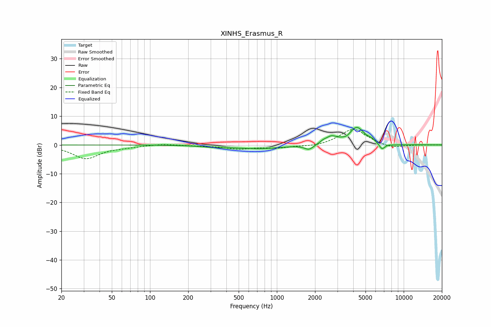

# XINHS_Erasmus_R
See [usage instructions](https://github.com/jaakkopasanen/AutoEq#usage) for more options and info.

### Parametric EQs
Apply preamp of -6.2 dB when using parametric equalizer.

|   # | Type    |   Fc (Hz) |    Q |   Gain (dB) |
|-----|---------|-----------|------|-------------|
|   1 | Peaking |       326 | 1.35 |        -0.5 |
|   2 | Peaking |       733 | 0.82 |        -1.3 |
|   3 | Peaking |      1794 | 3.89 |        -1.7 |
|   4 | Peaking |      2310 | 6    |         0.6 |
|   5 | Peaking |      2682 | 3.12 |         2.4 |
|   6 | Peaking |      3571 | 6    |        -0.6 |
|   7 | Peaking |      4264 | 2.31 |         6.1 |
|   8 | Peaking |      5604 | 6    |         0.7 |
|   9 | Peaking |      6751 | 6    |        -2.2 |
|  10 | Peaking |      8409 | 2.12 |        -0.2 |

### Fixed Band EQs
When using fixed band (also called graphic) equalizer, apply preamp of **-5.5 dB** (if available) and set gains manually with these parameters.

|   # | Type    |   Fc (Hz) |    Q |   Gain (dB) |
|-----|---------|-----------|------|-------------|
|   1 | Peaking |        31 | 1.41 |        -4.7 |
|   2 | Peaking |        62 | 1.41 |        -0.6 |
|   3 | Peaking |       125 | 1.41 |         0.4 |
|   4 | Peaking |       250 | 1.41 |        -0.2 |
|   5 | Peaking |       500 | 1.41 |        -1.3 |
|   6 | Peaking |      1000 | 1.41 |        -0.9 |
|   7 | Peaking |      2000 | 1.41 |        -0.7 |
|   8 | Peaking |      4000 | 1.41 |         5.7 |
|   9 | Peaking |      8000 | 1.41 |        -1.3 |
|  10 | Peaking |     16000 | 1.41 |         0   |

### Graphs

