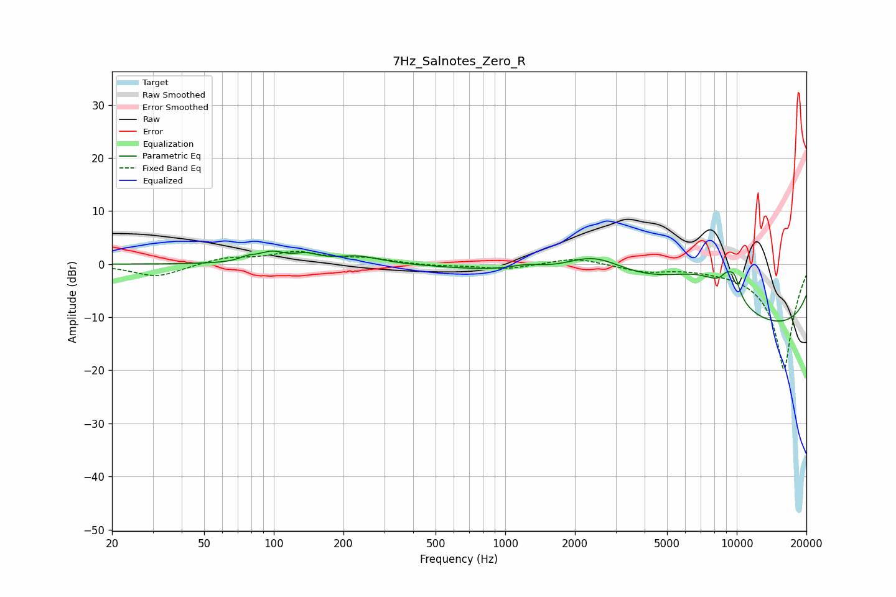

# 7Hz_Salnotes_Zero_R
See [usage instructions](https://github.com/jaakkopasanen/AutoEq#usage) for more options and info.

### Parametric EQs
Apply preamp of -2.6 dB when using parametric equalizer.

|   # | Type    |   Fc (Hz) |    Q |   Gain (dB) |
|-----|---------|-----------|------|-------------|
|   1 | Peaking |        77 | 4.05 |         0.7 |
|   2 | Peaking |        98 | 2.54 |         1.9 |
|   3 | Peaking |       138 | 2.66 |         1.3 |
|   4 | Peaking |       231 | 1.46 |         1.5 |
|   5 | Peaking |      1232 | 1.73 |         1.2 |
|   6 | Peaking |      2407 | 0.99 |         5.3 |
|   7 | Peaking |      7215 | 0.49 |        14.7 |
|   8 | Peaking |      9051 | 4.99 |         2.4 |
|   9 | Peaking |      9765 | 5.26 |         3.6 |
|  10 | Peaking |     10000 | 0.21 |       -19.1 |

### Fixed Band EQs
When using fixed band (also called graphic) equalizer, apply preamp of **-2.5 dB** (if available) and set gains manually with these parameters.

|   # | Type    |   Fc (Hz) |    Q |   Gain (dB) |
|-----|---------|-----------|------|-------------|
|   1 | Peaking |        31 | 1.41 |        -2.4 |
|   2 | Peaking |        62 | 1.41 |         1.2 |
|   3 | Peaking |       125 | 1.41 |         2.1 |
|   4 | Peaking |       250 | 1.41 |         1   |
|   5 | Peaking |       500 | 1.41 |        -0.3 |
|   6 | Peaking |      1000 | 1.41 |        -0.9 |
|   7 | Peaking |      2000 | 1.41 |         1.3 |
|   8 | Peaking |      4000 | 1.41 |        -1.2 |
|   9 | Peaking |      8000 | 1.41 |        -0.3 |
|  10 | Peaking |     16000 | 1.41 |       -20   |

### Graphs

