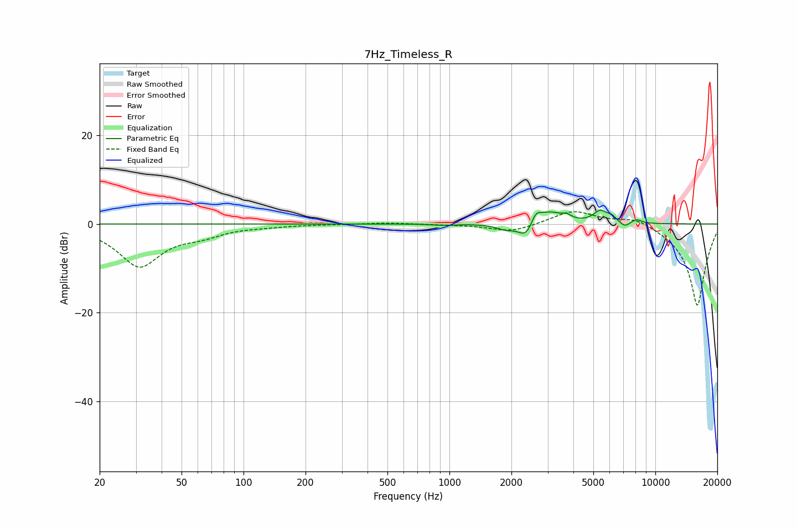

# 7Hz_Timeless_R
See [usage instructions](https://github.com/jaakkopasanen/AutoEq#usage) for more options and info.

### Parametric EQs
Apply preamp of -3.2 dB when using parametric equalizer.

|   # | Type    |   Fc (Hz) |    Q |   Gain (dB) |
|-----|---------|-----------|------|-------------|
|   1 | Peaking |       928 | 2.81 |        -0.3 |
|   2 | Peaking |      1882 | 2.97 |        -1.2 |
|   3 | Peaking |      2359 | 3.87 |        -3.4 |
|   4 | Peaking |      2627 | 6    |         2.4 |
|   5 | Peaking |      3046 | 2.26 |         2.7 |
|   6 | Peaking |      3702 | 6    |         0.9 |
|   7 | Peaking |      5396 | 4.19 |         2.6 |
|   8 | Peaking |      6121 | 6    |         1.1 |
|   9 | Peaking |      7112 | 5.99 |        -1.1 |
|  10 | Peaking |      8107 | 5.53 |         0.9 |

### Fixed Band EQs
When using fixed band (also called graphic) equalizer, apply preamp of **-2.9 dB** (if available) and set gains manually with these parameters.

|   # | Type    |   Fc (Hz) |    Q |   Gain (dB) |
|-----|---------|-----------|------|-------------|
|   1 | Peaking |        31 | 1.41 |        -9.4 |
|   2 | Peaking |        62 | 1.41 |        -1.9 |
|   3 | Peaking |       125 | 1.41 |        -0.4 |
|   4 | Peaking |       250 | 1.41 |        -0.1 |
|   5 | Peaking |       500 | 1.41 |         0.3 |
|   6 | Peaking |      1000 | 1.41 |        -0.1 |
|   7 | Peaking |      2000 | 1.41 |        -1.8 |
|   8 | Peaking |      4000 | 1.41 |         3.1 |
|   9 | Peaking |      8000 | 1.41 |         1.9 |
|  10 | Peaking |     16000 | 1.41 |       -18.6 |

### Graphs

