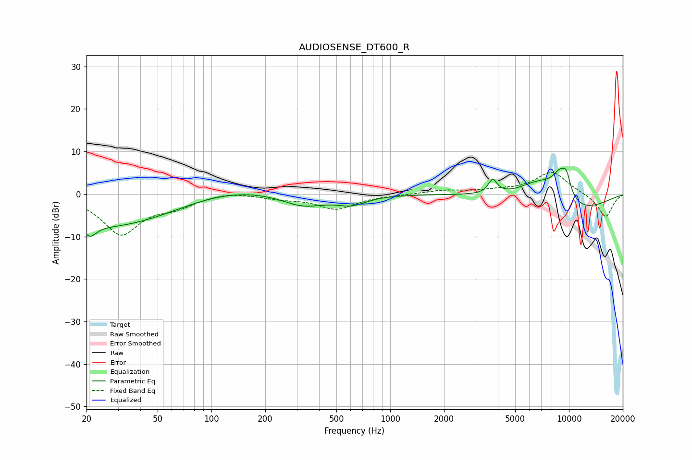

# AUDIOSENSE_DT600_R
See [usage instructions](https://github.com/jaakkopasanen/AutoEq#usage) for more options and info.

### Parametric EQs
Apply preamp of -6.2 dB when using parametric equalizer.

|   # | Type    |   Fc (Hz) |    Q |   Gain (dB) |
|-----|---------|-----------|------|-------------|
|   1 | Peaking |        21 | 4.05 |        -2.8 |
|   2 | Peaking |        28 | 0.36 |        -7.9 |
|   3 | Peaking |       115 | 0.48 |         2.6 |
|   4 | Peaking |       326 | 1.14 |        -3   |
|   5 | Peaking |       608 | 1.71 |        -2.1 |
|   6 | Peaking |      3742 | 5.86 |         3.3 |
|   7 | Peaking |      6824 | 1.14 |         5.4 |
|   8 | Peaking |      8976 | 2.55 |         6.6 |
|   9 | Peaking |      9697 | 5.74 |         3.3 |
|  10 | Peaking |     10000 | 0.57 |        -5.4 |

### Fixed Band EQs
When using fixed band (also called graphic) equalizer, apply preamp of **-5.2 dB** (if available) and set gains manually with these parameters.

|   # | Type    |   Fc (Hz) |    Q |   Gain (dB) |
|-----|---------|-----------|------|-------------|
|   1 | Peaking |        31 | 1.41 |        -9.3 |
|   2 | Peaking |        62 | 1.41 |        -2.3 |
|   3 | Peaking |       125 | 1.41 |         0.7 |
|   4 | Peaking |       250 | 1.41 |        -0.9 |
|   5 | Peaking |       500 | 1.41 |        -3.4 |
|   6 | Peaking |      1000 | 1.41 |        -0.2 |
|   7 | Peaking |      2000 | 1.41 |         0.8 |
|   8 | Peaking |      4000 | 1.41 |         0.6 |
|   9 | Peaking |      8000 | 1.41 |         5.2 |
|  10 | Peaking |     16000 | 1.41 |        -5.5 |

### Graphs

