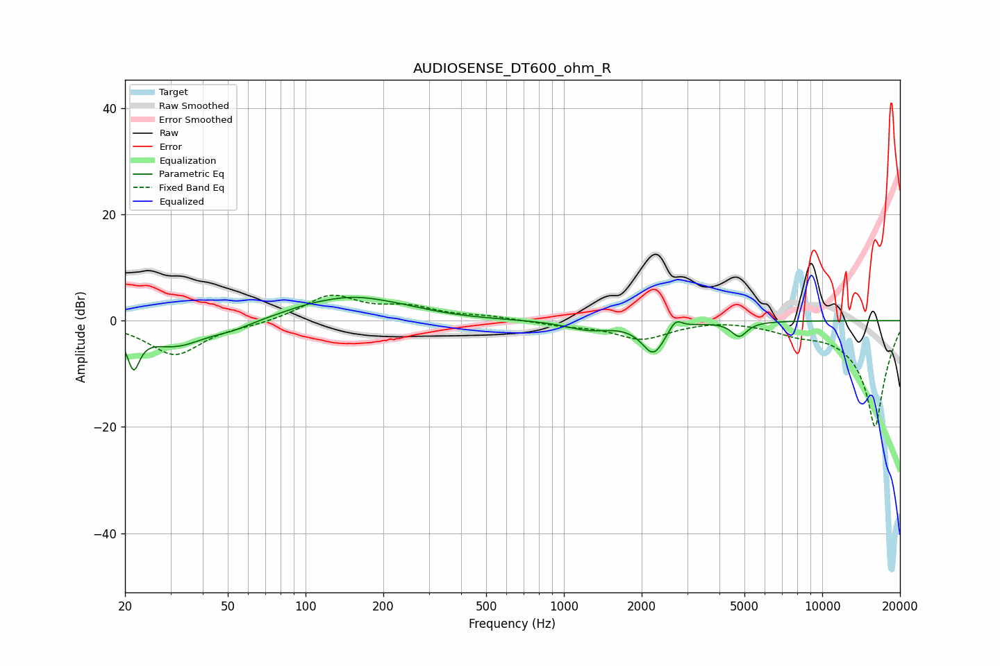

# AUDIOSENSE_DT600_ohm_R
See [usage instructions](https://github.com/jaakkopasanen/AutoEq#usage) for more options and info.

### Parametric EQs
Apply preamp of -4.5 dB when using parametric equalizer.

|   # | Type    |   Fc (Hz) |    Q |   Gain (dB) |
|-----|---------|-----------|------|-------------|
|   1 | Peaking |        22 | 5.97 |        -6.8 |
|   2 | Peaking |        31 | 1.16 |        -4.7 |
|   3 | Peaking |        52 | 1.99 |        -1   |
|   4 | Peaking |        99 | 1.64 |         0.5 |
|   5 | Peaking |       152 | 0.79 |         4.3 |
|   6 | Peaking |       251 | 1.34 |         0.4 |
|   7 | Peaking |      1244 | 1.65 |        -1.6 |
|   8 | Peaking |      2220 | 3.15 |        -5.9 |
|   9 | Peaking |      2704 | 5.7  |         2.1 |
|  10 | Peaking |      4772 | 4.69 |        -2.8 |

### Fixed Band EQs
When using fixed band (also called graphic) equalizer, apply preamp of **-4.9 dB** (if available) and set gains manually with these parameters.

|   # | Type    |   Fc (Hz) |    Q |   Gain (dB) |
|-----|---------|-----------|------|-------------|
|   1 | Peaking |        31 | 1.41 |        -6.4 |
|   2 | Peaking |        62 | 1.41 |        -0.6 |
|   3 | Peaking |       125 | 1.41 |         4.7 |
|   4 | Peaking |       250 | 1.41 |         2.2 |
|   5 | Peaking |       500 | 1.41 |         0.7 |
|   6 | Peaking |      1000 | 1.41 |        -0.8 |
|   7 | Peaking |      2000 | 1.41 |        -3.3 |
|   8 | Peaking |      4000 | 1.41 |         0.4 |
|   9 | Peaking |      8000 | 1.41 |        -1.5 |
|  10 | Peaking |     16000 | 1.41 |       -20   |

### Graphs

