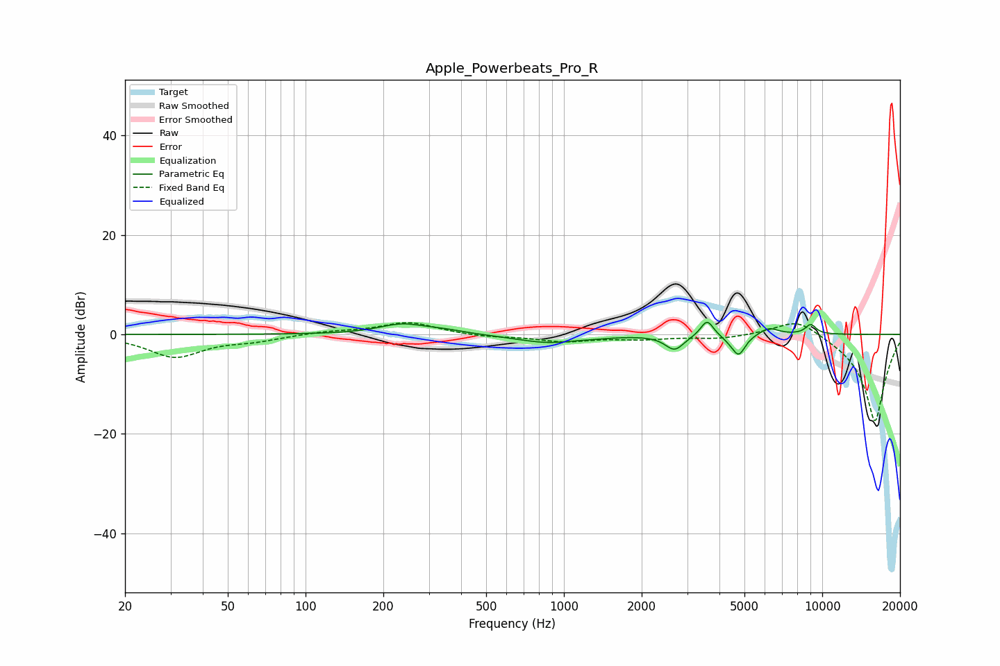

# Apple_Powerbeats_Pro_R
See [usage instructions](https://github.com/jaakkopasanen/AutoEq#usage) for more options and info.

### Parametric EQs
Apply preamp of -2.6 dB when using parametric equalizer.

|   # | Type    |   Fc (Hz) |    Q |   Gain (dB) |
|-----|---------|-----------|------|-------------|
|   1 | Peaking |       237 | 1.57 |         2   |
|   2 | Peaking |       344 | 1.81 |         0.6 |
|   3 | Peaking |       862 | 1.19 |        -1.6 |
|   4 | Peaking |      1339 | 1.92 |        -0.2 |
|   5 | Peaking |      2681 | 3.95 |        -3   |
|   6 | Peaking |      3585 | 5.69 |         3.4 |
|   7 | Peaking |      4491 | 3.89 |        -0.9 |
|   8 | Peaking |      4760 | 5.72 |        -3.6 |
|   9 | Peaking |      6222 | 3.79 |         1.5 |
|  10 | Peaking |      9026 | 6    |         2   |

### Fixed Band EQs
When using fixed band (also called graphic) equalizer, apply preamp of **-2.5 dB** (if available) and set gains manually with these parameters.

|   # | Type    |   Fc (Hz) |    Q |   Gain (dB) |
|-----|---------|-----------|------|-------------|
|   1 | Peaking |        31 | 1.41 |        -4.5 |
|   2 | Peaking |        62 | 1.41 |        -1.1 |
|   3 | Peaking |       125 | 1.41 |         0.6 |
|   4 | Peaking |       250 | 1.41 |         2.5 |
|   5 | Peaking |       500 | 1.41 |        -0.5 |
|   6 | Peaking |      1000 | 1.41 |        -1.3 |
|   7 | Peaking |      2000 | 1.41 |        -0.8 |
|   8 | Peaking |      4000 | 1.41 |        -0.8 |
|   9 | Peaking |      8000 | 1.41 |         3.7 |
|  10 | Peaking |     16000 | 1.41 |       -17.7 |

### Graphs

