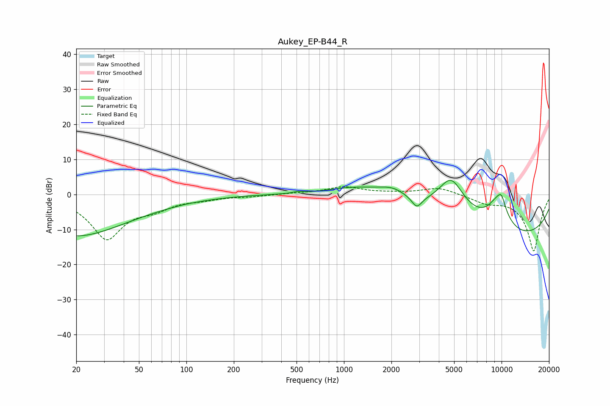

# Aukey_EP-B44_R
See [usage instructions](https://github.com/jaakkopasanen/AutoEq#usage) for more options and info.

### Parametric EQs
Apply preamp of -4.1 dB when using parametric equalizer.

|   # | Type    |   Fc (Hz) |    Q |   Gain (dB) |
|-----|---------|-----------|------|-------------|
|   1 | Peaking |        20 | 0.4  |       -11.8 |
|   2 | Peaking |        99 | 3.92 |         0.1 |
|   3 | Peaking |       504 | 5.79 |         0.4 |
|   4 | Peaking |      1271 | 0.71 |         3.6 |
|   5 | Peaking |      2053 | 1.48 |         3.2 |
|   6 | Peaking |      2898 | 4.66 |        -3   |
|   7 | Peaking |      4780 | 1.34 |        13.3 |
|   8 | Peaking |      9452 | 1.73 |         8.8 |
|   9 | Peaking |     10000 | 0.21 |       -13.5 |
|  10 | Peaking |     10000 | 5.26 |         3   |

### Fixed Band EQs
When using fixed band (also called graphic) equalizer, apply preamp of **-2.3 dB** (if available) and set gains manually with these parameters.

|   # | Type    |   Fc (Hz) |    Q |   Gain (dB) |
|-----|---------|-----------|------|-------------|
|   1 | Peaking |        31 | 1.41 |       -12.4 |
|   2 | Peaking |        62 | 1.41 |        -2.9 |
|   3 | Peaking |       125 | 1.41 |        -1   |
|   4 | Peaking |       250 | 1.41 |        -0.5 |
|   5 | Peaking |       500 | 1.41 |         0.3 |
|   6 | Peaking |      1000 | 1.41 |         2.1 |
|   7 | Peaking |      2000 | 1.41 |         0.3 |
|   8 | Peaking |      4000 | 1.41 |         2   |
|   9 | Peaking |      8000 | 1.41 |        -2   |
|  10 | Peaking |     16000 | 1.41 |       -16.2 |

### Graphs

