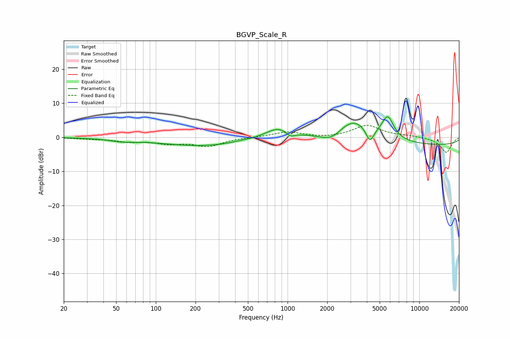

# BGVP_Scale_R
See [usage instructions](https://github.com/jaakkopasanen/AutoEq#usage) for more options and info.

### Parametric EQs
Apply preamp of -6.1 dB when using parametric equalizer.

|   # | Type    |   Fc (Hz) |    Q |   Gain (dB) |
|-----|---------|-----------|------|-------------|
|   1 | Peaking |        55 | 1.51 |        -0.7 |
|   2 | Peaking |       244 | 0.4  |        -2.6 |
|   3 | Peaking |       451 | 1.28 |         0.5 |
|   4 | Peaking |       847 | 1.43 |         3.4 |
|   5 | Peaking |      1051 | 4.35 |        -1.4 |
|   6 | Peaking |      2169 | 1.7  |        -3   |
|   7 | Peaking |      3138 | 0.99 |         7   |
|   8 | Peaking |      4220 | 4.45 |        -4.5 |
|   9 | Peaking |      5756 | 3.04 |         6.4 |
|  10 | Peaking |     10000 | 0.18 |        -2.4 |

### Fixed Band EQs
When using fixed band (also called graphic) equalizer, apply preamp of **-3.6 dB** (if available) and set gains manually with these parameters.

|   # | Type    |   Fc (Hz) |    Q |   Gain (dB) |
|-----|---------|-----------|------|-------------|
|   1 | Peaking |        31 | 1.41 |        -0.4 |
|   2 | Peaking |        62 | 1.41 |        -1.1 |
|   3 | Peaking |       125 | 1.41 |        -1.6 |
|   4 | Peaking |       250 | 1.41 |        -2.5 |
|   5 | Peaking |       500 | 1.41 |         0   |
|   6 | Peaking |      1000 | 1.41 |         1.6 |
|   7 | Peaking |      2000 | 1.41 |        -0.3 |
|   8 | Peaking |      4000 | 1.41 |         3.5 |
|   9 | Peaking |      8000 | 1.41 |         0.4 |
|  10 | Peaking |     16000 | 1.41 |        -4.5 |

### Graphs

