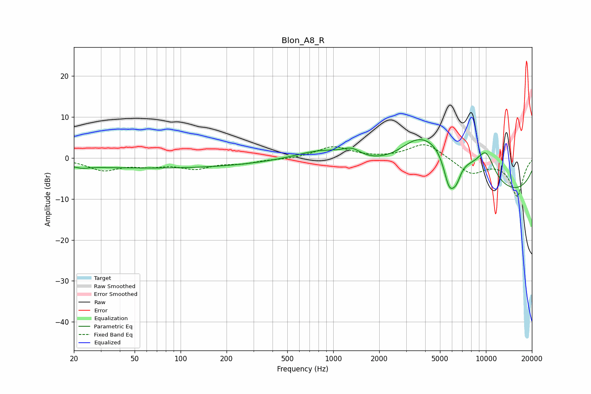

# Blon_A8_R
See [usage instructions](https://github.com/jaakkopasanen/AutoEq#usage) for more options and info.

### Parametric EQs
Apply preamp of -4.6 dB when using parametric equalizer.

|   # | Type    |   Fc (Hz) |    Q |   Gain (dB) |
|-----|---------|-----------|------|-------------|
|   1 | Peaking |        23 | 3.34 |        -0.5 |
|   2 | Peaking |        67 | 0.18 |        -2.5 |
|   3 | Peaking |       856 | 0.84 |         2.8 |
|   4 | Peaking |      1320 | 2.28 |         2.1 |
|   5 | Peaking |      3540 | 1.11 |         5.5 |
|   6 | Peaking |      5442 | 0.73 |        12.1 |
|   7 | Peaking |      5744 | 3    |       -10.2 |
|   8 | Peaking |      6393 | 4.12 |        -3.8 |
|   9 | Peaking |      9241 | 0.18 |       -10.6 |
|  10 | Peaking |      9991 | 2.02 |         6.8 |

### Fixed Band EQs
When using fixed band (also called graphic) equalizer, apply preamp of **-3.3 dB** (if available) and set gains manually with these parameters.

|   # | Type    |   Fc (Hz) |    Q |   Gain (dB) |
|-----|---------|-----------|------|-------------|
|   1 | Peaking |        31 | 1.41 |        -2.8 |
|   2 | Peaking |        62 | 1.41 |        -1.5 |
|   3 | Peaking |       125 | 1.41 |        -2.3 |
|   4 | Peaking |       250 | 1.41 |        -1.1 |
|   5 | Peaking |       500 | 1.41 |        -0.3 |
|   6 | Peaking |      1000 | 1.41 |         2.8 |
|   7 | Peaking |      2000 | 1.41 |        -0.1 |
|   8 | Peaking |      4000 | 1.41 |         3.8 |
|   9 | Peaking |      8000 | 1.41 |        -3.7 |
|  10 | Peaking |     16000 | 1.41 |        -9.2 |

### Graphs

