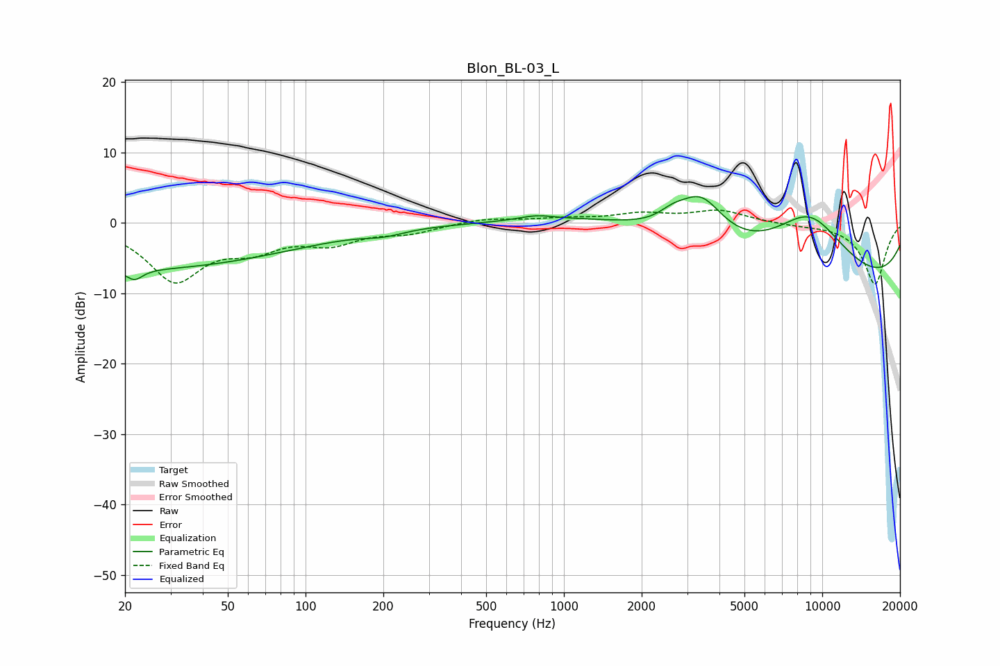

# Blon_BL-03_L
See [usage instructions](https://github.com/jaakkopasanen/AutoEq#usage) for more options and info.

### Parametric EQs
Apply preamp of -3.8 dB when using parametric equalizer.

|   # | Type    |   Fc (Hz) |    Q |   Gain (dB) |
|-----|---------|-----------|------|-------------|
|   1 | Peaking |        20 | 0.2  |        -6.6 |
|   2 | Peaking |        22 | 4.62 |        -1.5 |
|   3 | Peaking |       201 | 1.86 |        -0.7 |
|   4 | Peaking |       783 | 2.05 |         0.7 |
|   5 | Peaking |      1628 | 5.98 |        -0   |
|   6 | Peaking |      1749 | 0.49 |         2.8 |
|   7 | Peaking |      2637 | 2.61 |         1.4 |
|   8 | Peaking |      3395 | 1.54 |         6.7 |
|   9 | Peaking |      8880 | 0.75 |        10.7 |
|  10 | Peaking |      9701 | 0.19 |       -10.7 |

### Fixed Band EQs
When using fixed band (also called graphic) equalizer, apply preamp of **-1.9 dB** (if available) and set gains manually with these parameters.

|   # | Type    |   Fc (Hz) |    Q |   Gain (dB) |
|-----|---------|-----------|------|-------------|
|   1 | Peaking |        31 | 1.41 |        -7.9 |
|   2 | Peaking |        62 | 1.41 |        -2.9 |
|   3 | Peaking |       125 | 1.41 |        -2.5 |
|   4 | Peaking |       250 | 1.41 |        -1.2 |
|   5 | Peaking |       500 | 1.41 |         0.7 |
|   6 | Peaking |      1000 | 1.41 |         0.5 |
|   7 | Peaking |      2000 | 1.41 |         1.2 |
|   8 | Peaking |      4000 | 1.41 |         1.7 |
|   9 | Peaking |      8000 | 1.41 |        -0.3 |
|  10 | Peaking |     16000 | 1.41 |        -8.7 |

### Graphs

