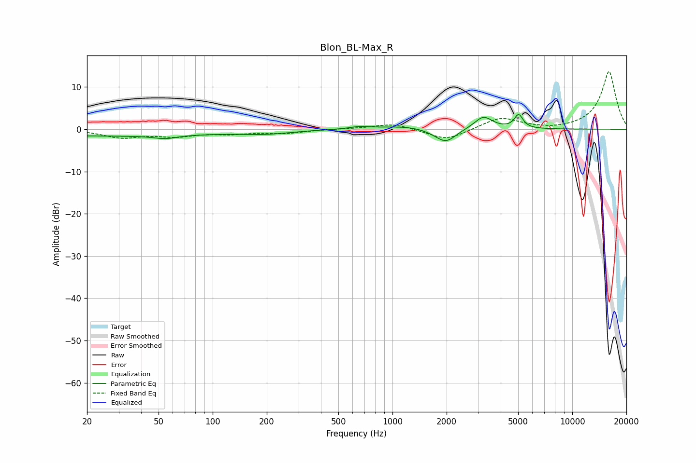

# Blon_BL-Max_R
See [usage instructions](https://github.com/jaakkopasanen/AutoEq#usage) for more options and info.

### Parametric EQs
Apply preamp of -3.6 dB when using parametric equalizer.

|   # | Type    |   Fc (Hz) |    Q |   Gain (dB) |
|-----|---------|-----------|------|-------------|
|   1 | Peaking |        26 | 0.21 |        -1.6 |
|   2 | Peaking |        54 | 3.48 |         1.3 |
|   3 | Peaking |        54 | 2.98 |        -2.1 |
|   4 | Peaking |       199 | 1.02 |        -0.8 |
|   5 | Peaking |       659 | 2.6  |         0.5 |
|   6 | Peaking |      1202 | 1    |         0.8 |
|   7 | Peaking |      1830 | 2.08 |        -1   |
|   8 | Peaking |      2002 | 2.63 |        -2.5 |
|   9 | Peaking |      3205 | 2.83 |         3   |
|  10 | Peaking |      5032 | 5.97 |         3.2 |

### Fixed Band EQs
When using fixed band (also called graphic) equalizer, apply preamp of **-13.7 dB** (if available) and set gains manually with these parameters.

|   # | Type    |   Fc (Hz) |    Q |   Gain (dB) |
|-----|---------|-----------|------|-------------|
|   1 | Peaking |        31 | 1.41 |        -1.9 |
|   2 | Peaking |        62 | 1.41 |        -1.4 |
|   3 | Peaking |       125 | 1.41 |        -0.9 |
|   4 | Peaking |       250 | 1.41 |        -0.9 |
|   5 | Peaking |       500 | 1.41 |         0   |
|   6 | Peaking |      1000 | 1.41 |         1.4 |
|   7 | Peaking |      2000 | 1.41 |        -2.7 |
|   8 | Peaking |      4000 | 1.41 |         2.8 |
|   9 | Peaking |      8000 | 1.41 |        -0.3 |
|  10 | Peaking |     16000 | 1.41 |        13.7 |

### Graphs

