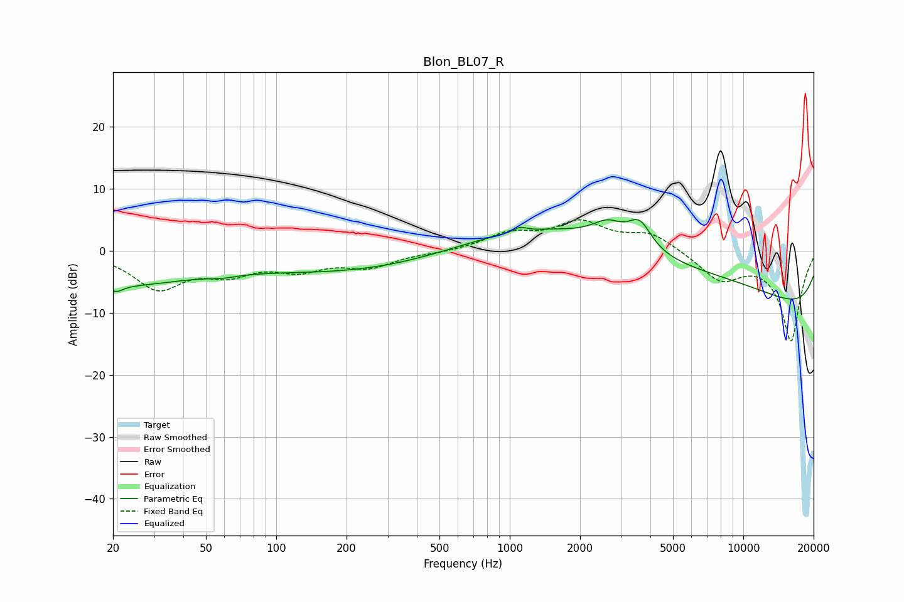

# Blon_BL07_R
See [usage instructions](https://github.com/jaakkopasanen/AutoEq#usage) for more options and info.

### Parametric EQs
Apply preamp of -5.1 dB when using parametric equalizer.

|   # | Type    |   Fc (Hz) |    Q |   Gain (dB) |
|-----|---------|-----------|------|-------------|
|   1 | Peaking |        20 | 0.41 |        -5.2 |
|   2 | Peaking |        21 | 4.9  |        -1   |
|   3 | Peaking |        59 | 2.27 |        -0.5 |
|   4 | Peaking |       229 | 0.3  |        -3.4 |
|   5 | Peaking |      1106 | 5.76 |         0.7 |
|   6 | Peaking |      2629 | 2.12 |         2.8 |
|   7 | Peaking |      3598 | 2.77 |         4.4 |
|   8 | Peaking |      4075 | 0.18 |         9.9 |
|   9 | Peaking |     10000 | 0.18 |        -6.5 |
|  10 | Peaking |     10000 | 0.18 |        -7   |

### Fixed Band EQs
When using fixed band (also called graphic) equalizer, apply preamp of **-5.1 dB** (if available) and set gains manually with these parameters.

|   # | Type    |   Fc (Hz) |    Q |   Gain (dB) |
|-----|---------|-----------|------|-------------|
|   1 | Peaking |        31 | 1.41 |        -5.8 |
|   2 | Peaking |        62 | 1.41 |        -3   |
|   3 | Peaking |       125 | 1.41 |        -2.6 |
|   4 | Peaking |       250 | 1.41 |        -2.4 |
|   5 | Peaking |       500 | 1.41 |        -0.3 |
|   6 | Peaking |      1000 | 1.41 |         2.5 |
|   7 | Peaking |      2000 | 1.41 |         4.3 |
|   8 | Peaking |      4000 | 1.41 |         2.7 |
|   9 | Peaking |      8000 | 1.41 |        -4.4 |
|  10 | Peaking |     16000 | 1.41 |       -14.5 |

### Graphs

