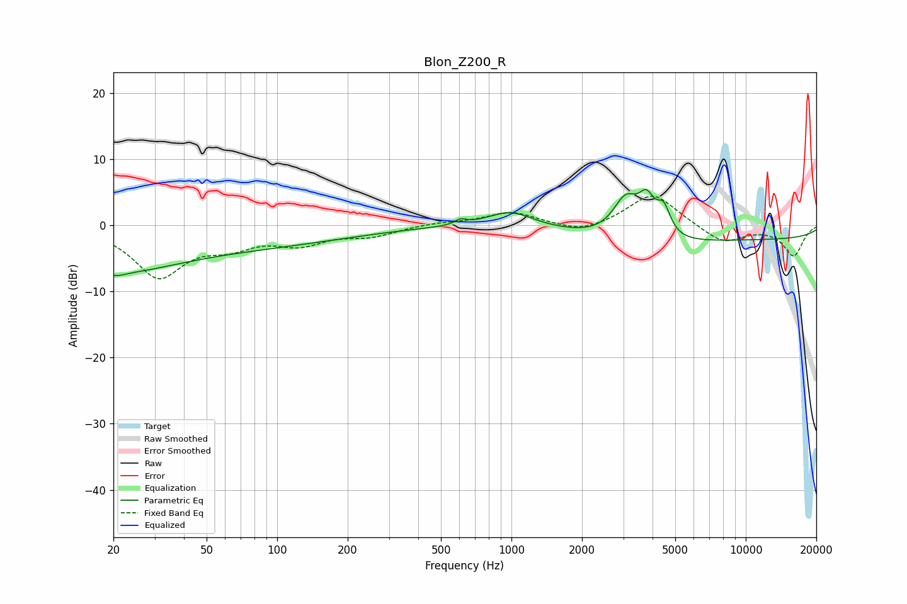

# Blon_Z200_R
See [usage instructions](https://github.com/jaakkopasanen/AutoEq#usage) for more options and info.

### Parametric EQs
Apply preamp of -5.5 dB when using parametric equalizer.

|   # | Type    |   Fc (Hz) |    Q |   Gain (dB) |
|-----|---------|-----------|------|-------------|
|   1 | Peaking |        20 | 3.73 |        -0.7 |
|   2 | Peaking |        21 | 0.54 |        -6   |
|   3 | Peaking |        85 | 0.37 |        -2.6 |
|   4 | Peaking |       607 | 5.98 |         0.7 |
|   5 | Peaking |       987 | 1.44 |         2.4 |
|   6 | Peaking |      3081 | 2.4  |         6.6 |
|   7 | Peaking |      3486 | 0.79 |        -2.1 |
|   8 | Peaking |      3777 | 4.07 |         4.8 |
|   9 | Peaking |      4458 | 4.75 |         4.1 |
|  10 | Peaking |     10000 | 0.18 |        -2.1 |

### Fixed Band EQs
When using fixed band (also called graphic) equalizer, apply preamp of **-4.5 dB** (if available) and set gains manually with these parameters.

|   # | Type    |   Fc (Hz) |    Q |   Gain (dB) |
|-----|---------|-----------|------|-------------|
|   1 | Peaking |        31 | 1.41 |        -7.5 |
|   2 | Peaking |        62 | 1.41 |        -2.4 |
|   3 | Peaking |       125 | 1.41 |        -2.4 |
|   4 | Peaking |       250 | 1.41 |        -1.4 |
|   5 | Peaking |       500 | 1.41 |         0.4 |
|   6 | Peaking |      1000 | 1.41 |         2   |
|   7 | Peaking |      2000 | 1.41 |        -1.3 |
|   8 | Peaking |      4000 | 1.41 |         5   |
|   9 | Peaking |      8000 | 1.41 |        -2.7 |
|  10 | Peaking |     16000 | 1.41 |        -4.6 |

### Graphs

