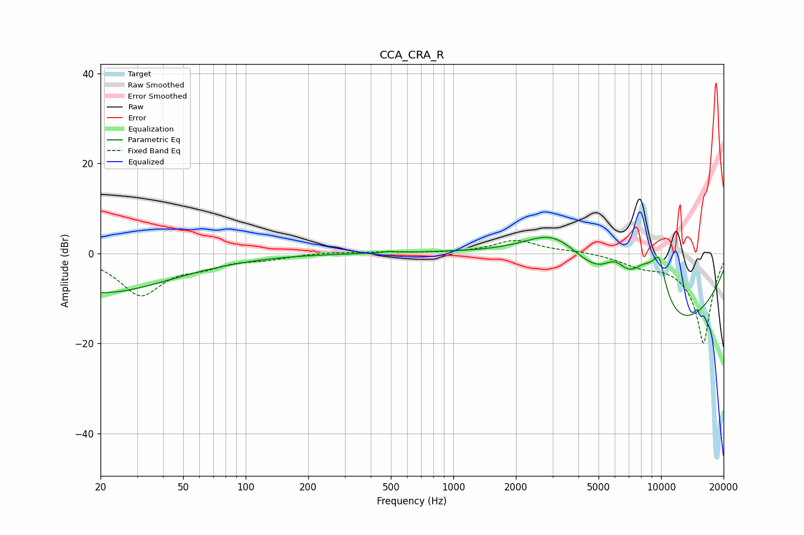

# CCA_CRA_R
See [usage instructions](https://github.com/jaakkopasanen/AutoEq#usage) for more options and info.

### Parametric EQs
Apply preamp of -3.7 dB when using parametric equalizer.

|   # | Type    |   Fc (Hz) |    Q |   Gain (dB) |
|-----|---------|-----------|------|-------------|
|   1 | Peaking |        20 | 0.4  |        -8.7 |
|   2 | Peaking |       489 | 5.48 |         0.3 |
|   3 | Peaking |      3040 | 1.01 |         5.8 |
|   4 | Peaking |      3610 | 0.4  |        14.1 |
|   5 | Peaking |      6012 | 2    |         6.8 |
|   6 | Peaking |      7325 | 0.39 |        -8.3 |
|   7 | Peaking |      7922 | 0.26 |       -20   |
|   8 | Peaking |      8156 | 1.57 |        10   |
|   9 | Peaking |      9627 | 2.17 |         8.4 |
|  10 | Peaking |      9824 | 5.32 |         3.6 |

### Fixed Band EQs
When using fixed band (also called graphic) equalizer, apply preamp of **-3.0 dB** (if available) and set gains manually with these parameters.

|   # | Type    |   Fc (Hz) |    Q |   Gain (dB) |
|-----|---------|-----------|------|-------------|
|   1 | Peaking |        31 | 1.41 |        -9   |
|   2 | Peaking |        62 | 1.41 |        -2.1 |
|   3 | Peaking |       125 | 1.41 |        -1   |
|   4 | Peaking |       250 | 1.41 |         0.3 |
|   5 | Peaking |       500 | 1.41 |         0.3 |
|   6 | Peaking |      1000 | 1.41 |         0   |
|   7 | Peaking |      2000 | 1.41 |         2.9 |
|   8 | Peaking |      4000 | 1.41 |         0.5 |
|   9 | Peaking |      8000 | 1.41 |        -1.9 |
|  10 | Peaking |     16000 | 1.41 |       -20   |

### Graphs

