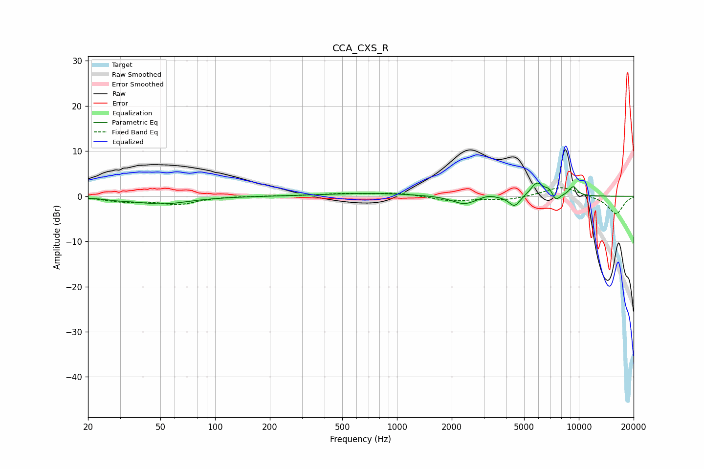

# CCA_CXS_R
See [usage instructions](https://github.com/jaakkopasanen/AutoEq#usage) for more options and info.

### Parametric EQs
Apply preamp of -3.0 dB when using parametric equalizer.

|   # | Type    |   Fc (Hz) |    Q |   Gain (dB) |
|-----|---------|-----------|------|-------------|
|   1 | Peaking |        29 | 1.8  |        -0.4 |
|   2 | Peaking |        52 | 0.98 |        -1.6 |
|   3 | Peaking |       714 | 0.58 |         0.7 |
|   4 | Peaking |      2347 | 2.12 |        -1.9 |
|   5 | Peaking |      3153 | 3.24 |         0.6 |
|   6 | Peaking |      4425 | 4.54 |        -2.4 |
|   7 | Peaking |      5882 | 3.95 |         3.1 |
|   8 | Peaking |      6873 | 5.95 |         1.3 |
|   9 | Peaking |      7452 | 5.8  |        -1.7 |
|  10 | Peaking |      9304 | 5.25 |         2.1 |

### Fixed Band EQs
When using fixed band (also called graphic) equalizer, apply preamp of **-2.0 dB** (if available) and set gains manually with these parameters.

|   # | Type    |   Fc (Hz) |    Q |   Gain (dB) |
|-----|---------|-----------|------|-------------|
|   1 | Peaking |        31 | 1.41 |        -1   |
|   2 | Peaking |        62 | 1.41 |        -1.7 |
|   3 | Peaking |       125 | 1.41 |         0.1 |
|   4 | Peaking |       250 | 1.41 |         0.1 |
|   5 | Peaking |       500 | 1.41 |         0.5 |
|   6 | Peaking |      1000 | 1.41 |         0.8 |
|   7 | Peaking |      2000 | 1.41 |        -1.1 |
|   8 | Peaking |      4000 | 1.41 |        -0.8 |
|   9 | Peaking |      8000 | 1.41 |         2.2 |
|  10 | Peaking |     16000 | 1.41 |        -4   |

### Graphs

