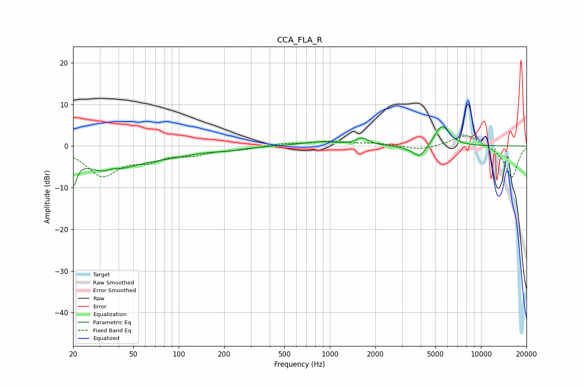

# CCA_FLA_R
See [usage instructions](https://github.com/jaakkopasanen/AutoEq#usage) for more options and info.

### Parametric EQs
Apply preamp of -4.8 dB when using parametric equalizer.

|   # | Type    |   Fc (Hz) |    Q |   Gain (dB) |
|-----|---------|-----------|------|-------------|
|   1 | Peaking |        20 | 5.98 |        -6.6 |
|   2 | Peaking |        34 | 0.94 |        -5.7 |
|   3 | Peaking |        37 | 3.36 |         1.1 |
|   4 | Peaking |        81 | 0.64 |        -2   |
|   5 | Peaking |       216 | 1.72 |        -0.5 |
|   6 | Peaking |       852 | 1.1  |         1   |
|   7 | Peaking |      1638 | 3.3  |         1.7 |
|   8 | Peaking |      3333 | 2.3  |        -0.4 |
|   9 | Peaking |      3940 | 3.33 |        -2.9 |
|  10 | Peaking |      5537 | 2.84 |         5.1 |

### Fixed Band EQs
When using fixed band (also called graphic) equalizer, apply preamp of **-2.6 dB** (if available) and set gains manually with these parameters.

|   # | Type    |   Fc (Hz) |    Q |   Gain (dB) |
|-----|---------|-----------|------|-------------|
|   1 | Peaking |        31 | 1.41 |        -6.8 |
|   2 | Peaking |        62 | 1.41 |        -2.7 |
|   3 | Peaking |       125 | 1.41 |        -1.7 |
|   4 | Peaking |       250 | 1.41 |        -0.7 |
|   5 | Peaking |       500 | 1.41 |         0.6 |
|   6 | Peaking |      1000 | 1.41 |         1   |
|   7 | Peaking |      2000 | 1.41 |         0.6 |
|   8 | Peaking |      4000 | 1.41 |        -1   |
|   9 | Peaking |      8000 | 1.41 |         3   |
|  10 | Peaking |     16000 | 1.41 |        -7.7 |

### Graphs

