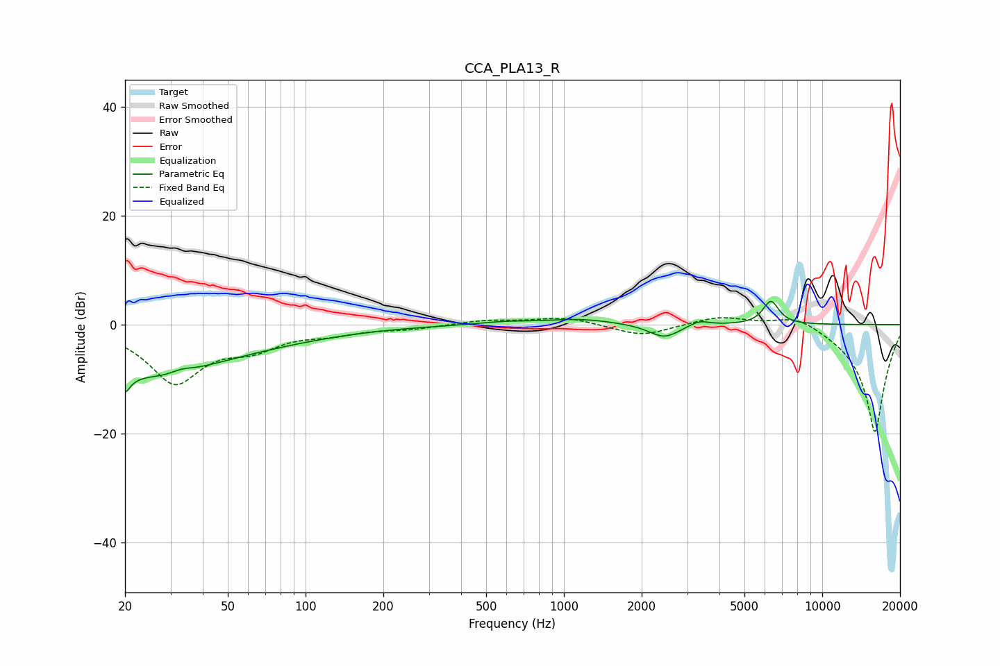

# CCA_PLA13_R
See [usage instructions](https://github.com/jaakkopasanen/AutoEq#usage) for more options and info.

### Parametric EQs
Apply preamp of -4.4 dB when using parametric equalizer.

|   # | Type    |   Fc (Hz) |    Q |   Gain (dB) |
|-----|---------|-----------|------|-------------|
|   1 | Peaking |        20 | 5.87 |       -10.4 |
|   2 | Peaking |        20 | 6    |         5.9 |
|   3 | Peaking |        26 | 0.63 |        -7.8 |
|   4 | Peaking |        33 | 3.54 |         0.7 |
|   5 | Peaking |        61 | 0.45 |        -2.3 |
|   6 | Peaking |       593 | 1.37 |         0.5 |
|   7 | Peaking |      1159 | 1.09 |         1   |
|   8 | Peaking |      2447 | 2.38 |        -2.5 |
|   9 | Peaking |      3341 | 3.61 |         1   |
|  10 | Peaking |      6327 | 4.46 |         4.3 |

### Fixed Band EQs
When using fixed band (also called graphic) equalizer, apply preamp of **-1.4 dB** (if available) and set gains manually with these parameters.

|   # | Type    |   Fc (Hz) |    Q |   Gain (dB) |
|-----|---------|-----------|------|-------------|
|   1 | Peaking |        31 | 1.41 |       -10.4 |
|   2 | Peaking |        62 | 1.41 |        -3.3 |
|   3 | Peaking |       125 | 1.41 |        -1.3 |
|   4 | Peaking |       250 | 1.41 |        -0.7 |
|   5 | Peaking |       500 | 1.41 |         0.8 |
|   6 | Peaking |      1000 | 1.41 |         1.4 |
|   7 | Peaking |      2000 | 1.41 |        -2.1 |
|   8 | Peaking |      4000 | 1.41 |         1.6 |
|   9 | Peaking |      8000 | 1.41 |         2.3 |
|  10 | Peaking |     16000 | 1.41 |       -20   |

### Graphs

