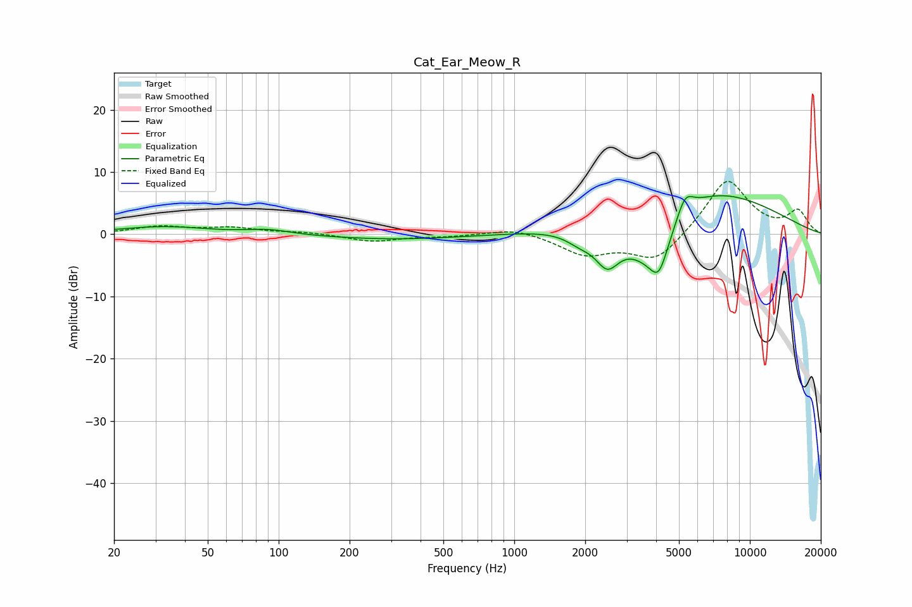

# Cat_Ear_Meow_R
See [usage instructions](https://github.com/jaakkopasanen/AutoEq#usage) for more options and info.

### Parametric EQs
Apply preamp of -6.3 dB when using parametric equalizer.

|   # | Type    |   Fc (Hz) |    Q |   Gain (dB) |
|-----|---------|-----------|------|-------------|
|   1 | Peaking |        32 | 0.75 |         1.2 |
|   2 | Peaking |        91 | 1.56 |         0.7 |
|   3 | Peaking |       313 | 0.47 |        -0.8 |
|   4 | Peaking |      1898 | 2.31 |        -1.6 |
|   5 | Peaking |      2482 | 2.68 |        -5.3 |
|   6 | Peaking |      3787 | 1.15 |        -8.2 |
|   7 | Peaking |      4117 | 3.62 |        -7.3 |
|   8 | Peaking |      4133 | 4.21 |         2   |
|   9 | Peaking |      5305 | 3.88 |         3.4 |
|  10 | Peaking |      5972 | 0.43 |         8.6 |

### Fixed Band EQs
When using fixed band (also called graphic) equalizer, apply preamp of **-8.6 dB** (if available) and set gains manually with these parameters.

|   # | Type    |   Fc (Hz) |    Q |   Gain (dB) |
|-----|---------|-----------|------|-------------|
|   1 | Peaking |        31 | 1.41 |         1.2 |
|   2 | Peaking |        62 | 1.41 |         1   |
|   3 | Peaking |       125 | 1.41 |         0.3 |
|   4 | Peaking |       250 | 1.41 |        -1.1 |
|   5 | Peaking |       500 | 1.41 |        -0.3 |
|   6 | Peaking |      1000 | 1.41 |         1.1 |
|   7 | Peaking |      2000 | 1.41 |        -3.1 |
|   8 | Peaking |      4000 | 1.41 |        -4.5 |
|   9 | Peaking |      8000 | 1.41 |         9   |
|  10 | Peaking |     16000 | 1.41 |         3.6 |

### Graphs

