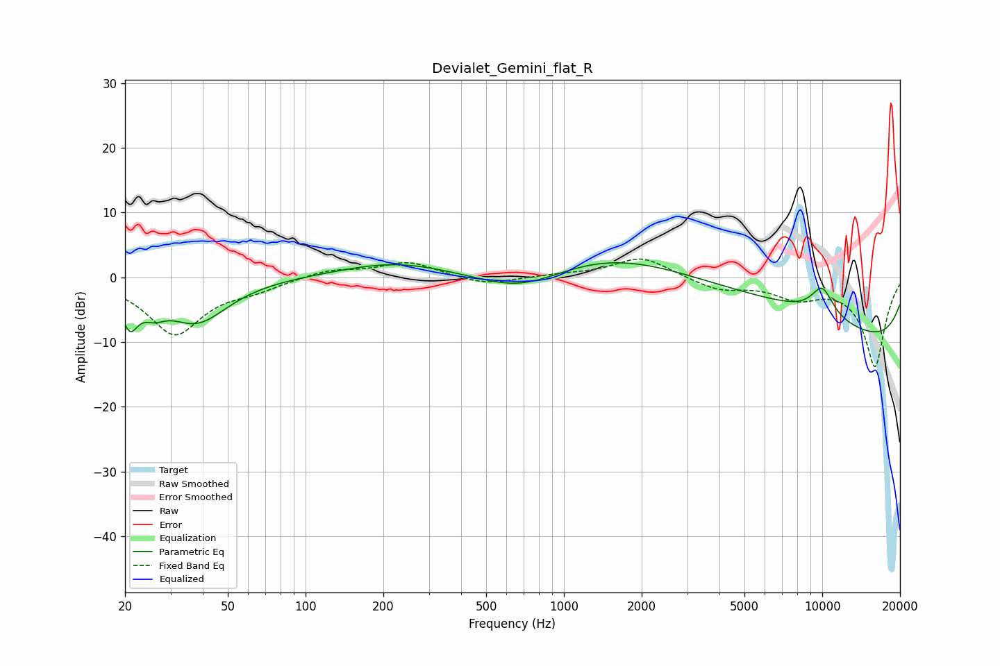

# Devialet_Gemini_flat_R
See [usage instructions](https://github.com/jaakkopasanen/AutoEq#usage) for more options and info.

### Parametric EQs
Apply preamp of -2.3 dB when using parametric equalizer.

|   # | Type    |   Fc (Hz) |    Q |   Gain (dB) |
|-----|---------|-----------|------|-------------|
|   1 | Peaking |        21 | 4.39 |        -5.5 |
|   2 | Peaking |        26 | 3.25 |        -2.2 |
|   3 | Peaking |        38 | 1.34 |        -3.6 |
|   4 | Peaking |        38 | 0.99 |        -3.1 |
|   5 | Peaking |       218 | 0.67 |         2.2 |
|   6 | Peaking |       688 | 0.72 |        -5.4 |
|   7 | Peaking |      3653 | 0.18 |        10.9 |
|   8 | Peaking |      9658 | 0.18 |        -8.4 |
|   9 | Peaking |      9858 | 0.18 |        -6   |
|  10 | Peaking |     10000 | 2.72 |         4.5 |

### Fixed Band EQs
When using fixed band (also called graphic) equalizer, apply preamp of **-2.9 dB** (if available) and set gains manually with these parameters.

|   # | Type    |   Fc (Hz) |    Q |   Gain (dB) |
|-----|---------|-----------|------|-------------|
|   1 | Peaking |        31 | 1.41 |        -8.7 |
|   2 | Peaking |        62 | 1.41 |        -1.4 |
|   3 | Peaking |       125 | 1.41 |         1.2 |
|   4 | Peaking |       250 | 1.41 |         2.3 |
|   5 | Peaking |       500 | 1.41 |        -1.3 |
|   6 | Peaking |      1000 | 1.41 |         0.3 |
|   7 | Peaking |      2000 | 1.41 |         3.2 |
|   8 | Peaking |      4000 | 1.41 |        -1.9 |
|   9 | Peaking |      8000 | 1.41 |        -2.7 |
|  10 | Peaking |     16000 | 1.41 |       -13.8 |

### Graphs

