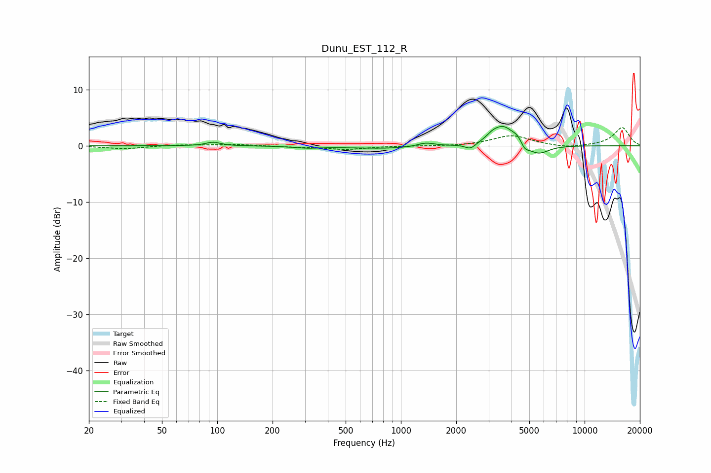

# Dunu_EST_112_R
See [usage instructions](https://github.com/jaakkopasanen/AutoEq#usage) for more options and info.

### Parametric EQs
Apply preamp of -3.5 dB when using parametric equalizer.

|   # | Type    |   Fc (Hz) |    Q |   Gain (dB) |
|-----|---------|-----------|------|-------------|
|   1 | Peaking |        95 | 3.67 |         0.6 |
|   2 | Peaking |       308 | 2.02 |        -0.3 |
|   3 | Peaking |       823 | 0.69 |        -0.5 |
|   4 | Peaking |      1367 | 3    |         0.7 |
|   5 | Peaking |      2391 | 4.76 |        -1   |
|   6 | Peaking |      3140 | 4.8  |         0.6 |
|   7 | Peaking |      3596 | 2.26 |         3.5 |
|   8 | Peaking |      4322 | 5.3  |         0.9 |
|   9 | Peaking |      4718 | 6    |        -1.2 |
|  10 | Peaking |      5585 | 2.43 |        -1.8 |

### Fixed Band EQs
When using fixed band (also called graphic) equalizer, apply preamp of **-3.3 dB** (if available) and set gains manually with these parameters.

|   # | Type    |   Fc (Hz) |    Q |   Gain (dB) |
|-----|---------|-----------|------|-------------|
|   1 | Peaking |        31 | 1.41 |        -0.5 |
|   2 | Peaking |        62 | 1.41 |         0.2 |
|   3 | Peaking |       125 | 1.41 |         0.3 |
|   4 | Peaking |       250 | 1.41 |        -0.2 |
|   5 | Peaking |       500 | 1.41 |        -0.6 |
|   6 | Peaking |      1000 | 1.41 |        -0   |
|   7 | Peaking |      2000 | 1.41 |        -0.1 |
|   8 | Peaking |      4000 | 1.41 |         1.8 |
|   9 | Peaking |      8000 | 1.41 |        -0.5 |
|  10 | Peaking |     16000 | 1.41 |         3.2 |

### Graphs

