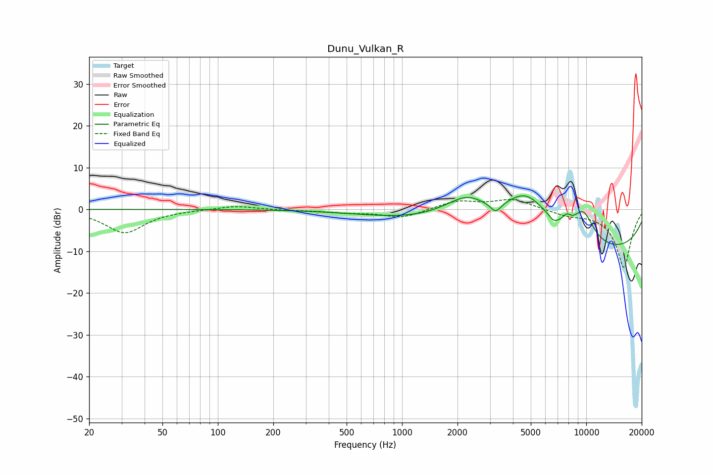

# Dunu_Vulkan_R
See [usage instructions](https://github.com/jaakkopasanen/AutoEq#usage) for more options and info.

### Parametric EQs
Apply preamp of -3.3 dB when using parametric equalizer.

|   # | Type    |   Fc (Hz) |    Q |   Gain (dB) |
|-----|---------|-----------|------|-------------|
|   1 | Peaking |      1141 | 0.49 |        -1.7 |
|   2 | Peaking |      2180 | 1    |         4.6 |
|   3 | Peaking |      2277 | 1.79 |         1.3 |
|   4 | Peaking |      3225 | 4.89 |        -2.4 |
|   5 | Peaking |      4728 | 0.99 |        10.8 |
|   6 | Peaking |      6652 | 5.53 |        -1.2 |
|   7 | Peaking |      7844 | 5.92 |         1.7 |
|   8 | Peaking |      9646 | 2.08 |         7.2 |
|   9 | Peaking |     10000 | 0.22 |        -3.5 |
|  10 | Peaking |     10000 | 0.21 |        -7.1 |

### Fixed Band EQs
When using fixed band (also called graphic) equalizer, apply preamp of **-2.5 dB** (if available) and set gains manually with these parameters.

|   # | Type    |   Fc (Hz) |    Q |   Gain (dB) |
|-----|---------|-----------|------|-------------|
|   1 | Peaking |        31 | 1.41 |        -5.6 |
|   2 | Peaking |        62 | 1.41 |        -0.1 |
|   3 | Peaking |       125 | 1.41 |         0.9 |
|   4 | Peaking |       250 | 1.41 |        -0.2 |
|   5 | Peaking |       500 | 1.41 |        -0.7 |
|   6 | Peaking |      1000 | 1.41 |        -2   |
|   7 | Peaking |      2000 | 1.41 |         2   |
|   8 | Peaking |      4000 | 1.41 |         2.4 |
|   9 | Peaking |      8000 | 1.41 |        -1.2 |
|  10 | Peaking |     16000 | 1.41 |       -13.9 |

### Graphs

