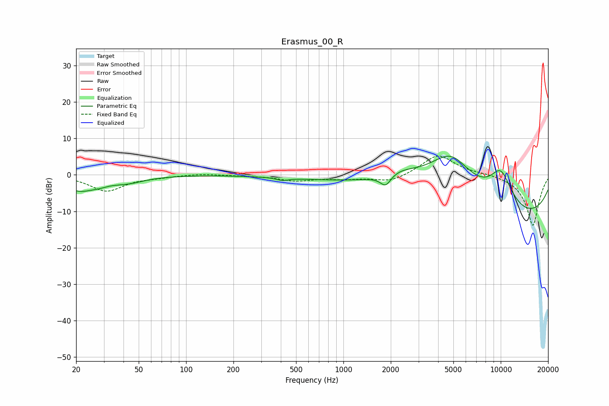

# Erasmus_00_R
See [usage instructions](https://github.com/jaakkopasanen/AutoEq#usage) for more options and info.

### Parametric EQs
Apply preamp of -5.2 dB when using parametric equalizer.

|   # | Type    |   Fc (Hz) |    Q |   Gain (dB) |
|-----|---------|-----------|------|-------------|
|   1 | Peaking |        21 | 1.32 |        -4   |
|   2 | Peaking |        28 | 2.75 |        -0.6 |
|   3 | Peaking |        42 | 1.29 |        -1.6 |
|   4 | Peaking |       409 | 3.86 |        -0.7 |
|   5 | Peaking |       818 | 0.44 |        -0.9 |
|   6 | Peaking |      1855 | 4.17 |        -3.1 |
|   7 | Peaking |      2292 | 1.43 |         1.8 |
|   8 | Peaking |      4830 | 0.67 |        16.9 |
|   9 | Peaking |      9545 | 0.27 |       -18.9 |
|  10 | Peaking |     10000 | 1.29 |        13.2 |

### Fixed Band EQs
When using fixed band (also called graphic) equalizer, apply preamp of **-5.2 dB** (if available) and set gains manually with these parameters.

|   # | Type    |   Fc (Hz) |    Q |   Gain (dB) |
|-----|---------|-----------|------|-------------|
|   1 | Peaking |        31 | 1.41 |        -4.4 |
|   2 | Peaking |        62 | 1.41 |        -0.5 |
|   3 | Peaking |       125 | 1.41 |         0.4 |
|   4 | Peaking |       250 | 1.41 |        -0.2 |
|   5 | Peaking |       500 | 1.41 |        -1.5 |
|   6 | Peaking |      1000 | 1.41 |        -0.9 |
|   7 | Peaking |      2000 | 1.41 |        -2   |
|   8 | Peaking |      4000 | 1.41 |         5.7 |
|   9 | Peaking |      8000 | 1.41 |         0.4 |
|  10 | Peaking |     16000 | 1.41 |       -14   |

### Graphs

