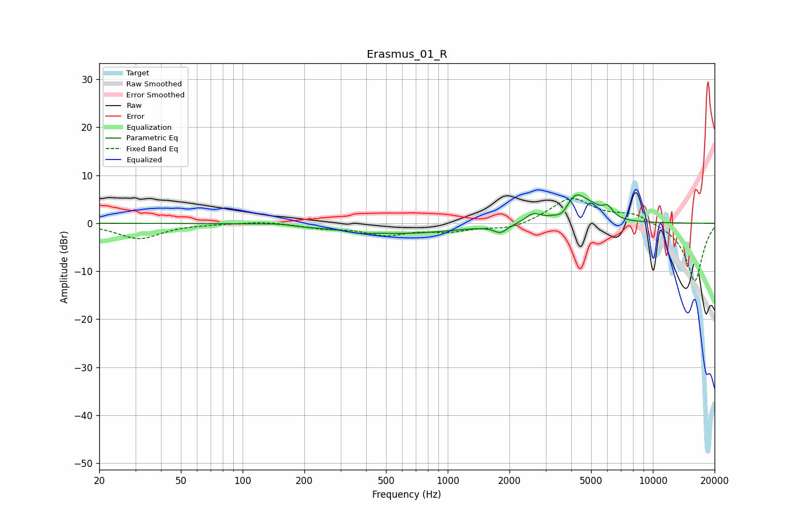

# Erasmus_01_R
See [usage instructions](https://github.com/jaakkopasanen/AutoEq#usage) for more options and info.

### Parametric EQs
Apply preamp of -6.0 dB when using parametric equalizer.

|   # | Type    |   Fc (Hz) |    Q |   Gain (dB) |
|-----|---------|-----------|------|-------------|
|   1 | Peaking |       150 | 1.66 |         0.4 |
|   2 | Peaking |       199 | 1.7  |        -0.3 |
|   3 | Peaking |       367 | 2.77 |        -0.5 |
|   4 | Peaking |       609 | 0.52 |        -2.1 |
|   5 | Peaking |      1810 | 4.33 |        -1.6 |
|   6 | Peaking |      2602 | 3.99 |         1.7 |
|   7 | Peaking |      3634 | 4.46 |        -1.7 |
|   8 | Peaking |      4200 | 2.37 |         6.1 |
|   9 | Peaking |      5124 | 3.73 |         1.1 |
|  10 | Peaking |      6021 | 5.34 |         2.2 |

### Fixed Band EQs
When using fixed band (also called graphic) equalizer, apply preamp of **-5.2 dB** (if available) and set gains manually with these parameters.

|   # | Type    |   Fc (Hz) |    Q |   Gain (dB) |
|-----|---------|-----------|------|-------------|
|   1 | Peaking |        31 | 1.41 |        -3.2 |
|   2 | Peaking |        62 | 1.41 |        -0.1 |
|   3 | Peaking |       125 | 1.41 |         0.5 |
|   4 | Peaking |       250 | 1.41 |        -0.9 |
|   5 | Peaking |       500 | 1.41 |        -2.2 |
|   6 | Peaking |      1000 | 1.41 |        -1.4 |
|   7 | Peaking |      2000 | 1.41 |        -1.3 |
|   8 | Peaking |      4000 | 1.41 |         5.3 |
|   9 | Peaking |      8000 | 1.41 |         2   |
|  10 | Peaking |     16000 | 1.41 |       -12.2 |

### Graphs

