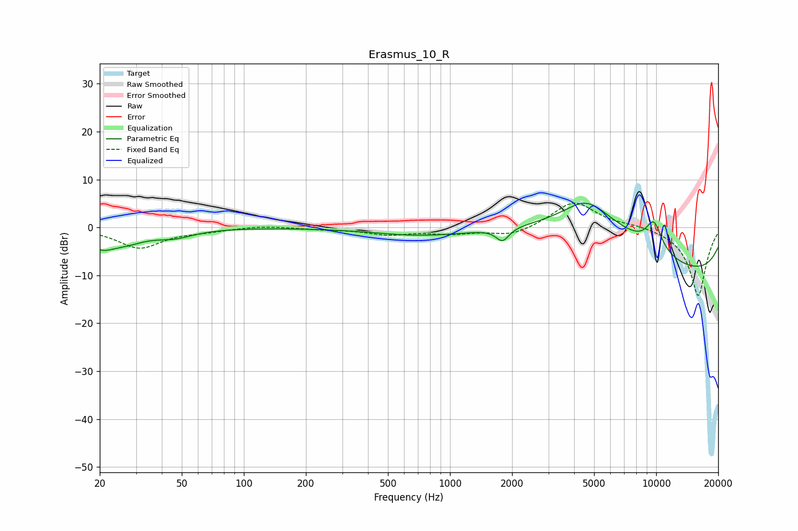

# Erasmus_10_R
See [usage instructions](https://github.com/jaakkopasanen/AutoEq#usage) for more options and info.

### Parametric EQs
Apply preamp of -5.1 dB when using parametric equalizer.

|   # | Type    |   Fc (Hz) |    Q |   Gain (dB) |
|-----|---------|-----------|------|-------------|
|   1 | Peaking |        20 | 4.47 |         0.8 |
|   2 | Peaking |        20 | 2.68 |        -3.7 |
|   3 | Peaking |        26 | 1.43 |        -2.6 |
|   4 | Peaking |        46 | 1.5  |        -1.6 |
|   5 | Peaking |       725 | 0.62 |        -1.6 |
|   6 | Peaking |      1798 | 4.55 |        -2.7 |
|   7 | Peaking |      4599 | 1.29 |         4.9 |
|   8 | Peaking |      5006 | 0.39 |        10.3 |
|   9 | Peaking |      9752 | 3.16 |         5.9 |
|  10 | Peaking |     10000 | 0.18 |       -12.1 |

### Fixed Band EQs
When using fixed band (also called graphic) equalizer, apply preamp of **-5.2 dB** (if available) and set gains manually with these parameters.

|   # | Type    |   Fc (Hz) |    Q |   Gain (dB) |
|-----|---------|-----------|------|-------------|
|   1 | Peaking |        31 | 1.41 |        -4.2 |
|   2 | Peaking |        62 | 1.41 |        -0.6 |
|   3 | Peaking |       125 | 1.41 |         0.4 |
|   4 | Peaking |       250 | 1.41 |        -0.3 |
|   5 | Peaking |       500 | 1.41 |        -1.3 |
|   6 | Peaking |      1000 | 1.41 |        -1.1 |
|   7 | Peaking |      2000 | 1.41 |        -1.8 |
|   8 | Peaking |      4000 | 1.41 |         5.6 |
|   9 | Peaking |      8000 | 1.41 |         0.6 |
|  10 | Peaking |     16000 | 1.41 |       -14.4 |

### Graphs

