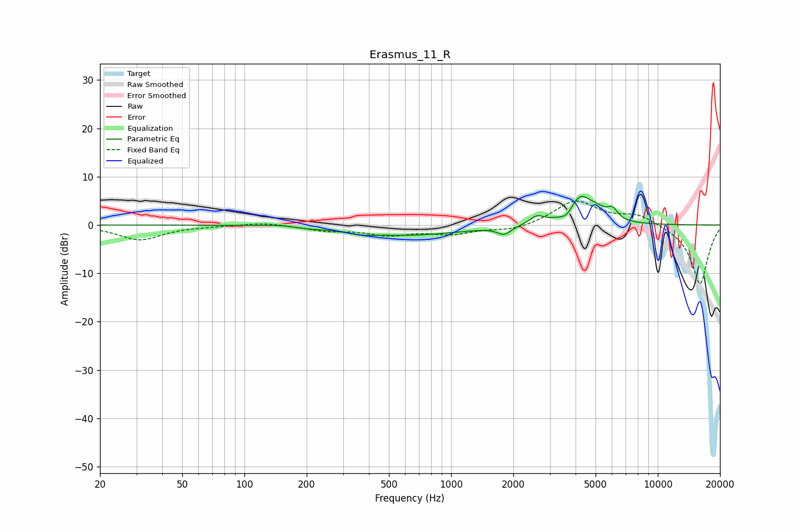

# Erasmus_11_R
See [usage instructions](https://github.com/jaakkopasanen/AutoEq#usage) for more options and info.

### Parametric EQs
Apply preamp of -6.0 dB when using parametric equalizer.

|   # | Type    |   Fc (Hz) |    Q |   Gain (dB) |
|-----|---------|-----------|------|-------------|
|   1 | Peaking |       147 | 1.66 |         0.4 |
|   2 | Peaking |       196 | 1.81 |        -0.3 |
|   3 | Peaking |       370 | 2.72 |        -0.5 |
|   4 | Peaking |       610 | 0.53 |        -2.1 |
|   5 | Peaking |      1806 | 4.31 |        -1.6 |
|   6 | Peaking |      2597 | 4.06 |         1.6 |
|   7 | Peaking |      3633 | 4.49 |        -1.7 |
|   8 | Peaking |      4214 | 2.38 |         6   |
|   9 | Peaking |      5154 | 3.72 |         1.2 |
|  10 | Peaking |      6036 | 5.38 |         2.1 |

### Fixed Band EQs
When using fixed band (also called graphic) equalizer, apply preamp of **-5.1 dB** (if available) and set gains manually with these parameters.

|   # | Type    |   Fc (Hz) |    Q |   Gain (dB) |
|-----|---------|-----------|------|-------------|
|   1 | Peaking |        31 | 1.41 |        -3   |
|   2 | Peaking |        62 | 1.41 |        -0.1 |
|   3 | Peaking |       125 | 1.41 |         0.6 |
|   4 | Peaking |       250 | 1.41 |        -1   |
|   5 | Peaking |       500 | 1.41 |        -1.9 |
|   6 | Peaking |      1000 | 1.41 |        -1.6 |
|   7 | Peaking |      2000 | 1.41 |        -1.2 |
|   8 | Peaking |      4000 | 1.41 |         5.1 |
|   9 | Peaking |      8000 | 1.41 |         2.2 |
|  10 | Peaking |     16000 | 1.41 |       -12.4 |

### Graphs

