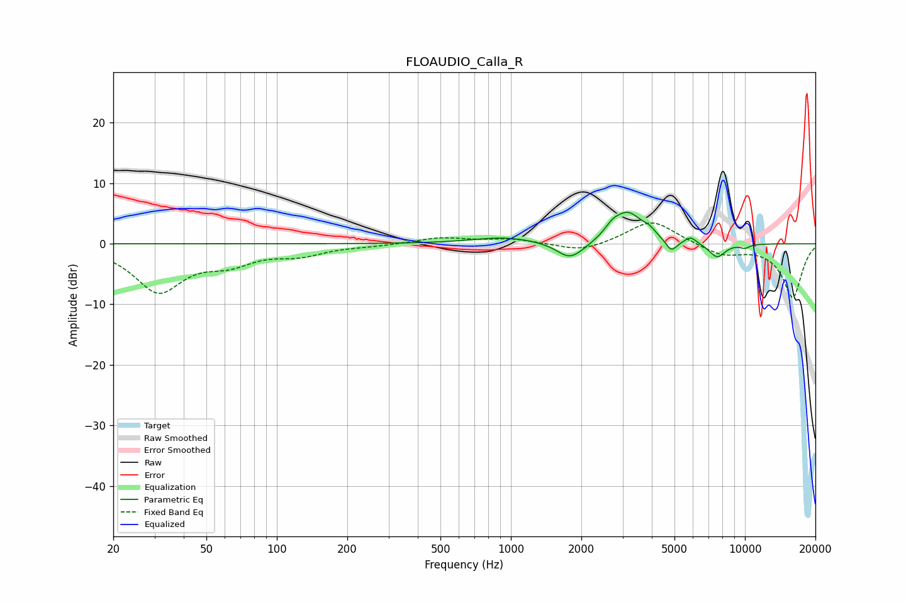

# FLOAUDIO_Calla_R
See [usage instructions](https://github.com/jaakkopasanen/AutoEq#usage) for more options and info.

### Parametric EQs
Apply preamp of -5.3 dB when using parametric equalizer.

|   # | Type    |   Fc (Hz) |    Q |   Gain (dB) |
|-----|---------|-----------|------|-------------|
|   1 | Peaking |       934 | 1.05 |         1   |
|   2 | Peaking |      1781 | 2.52 |        -2.6 |
|   3 | Peaking |      2008 | 2.18 |        -0.5 |
|   4 | Peaking |      2716 | 4.45 |         1.2 |
|   5 | Peaking |      3165 | 2.17 |         5   |
|   6 | Peaking |      3903 | 5.78 |         0.8 |
|   7 | Peaking |      4847 | 5.82 |        -2   |
|   8 | Peaking |      5867 | 5.92 |         1.1 |
|   9 | Peaking |      7606 | 3.86 |        -2.4 |
|  10 | Peaking |     10000 | 5.99 |        -0.6 |

### Fixed Band EQs
When using fixed band (also called graphic) equalizer, apply preamp of **-3.5 dB** (if available) and set gains manually with these parameters.

|   # | Type    |   Fc (Hz) |    Q |   Gain (dB) |
|-----|---------|-----------|------|-------------|
|   1 | Peaking |        31 | 1.41 |        -7.7 |
|   2 | Peaking |        62 | 1.41 |        -2.6 |
|   3 | Peaking |       125 | 1.41 |        -1.6 |
|   4 | Peaking |       250 | 1.41 |        -0.3 |
|   5 | Peaking |       500 | 1.41 |         1   |
|   6 | Peaking |      1000 | 1.41 |         0.8 |
|   7 | Peaking |      2000 | 1.41 |        -1.4 |
|   8 | Peaking |      4000 | 1.41 |         4   |
|   9 | Peaking |      8000 | 1.41 |        -1.8 |
|  10 | Peaking |     16000 | 1.41 |        -8.9 |

### Graphs

