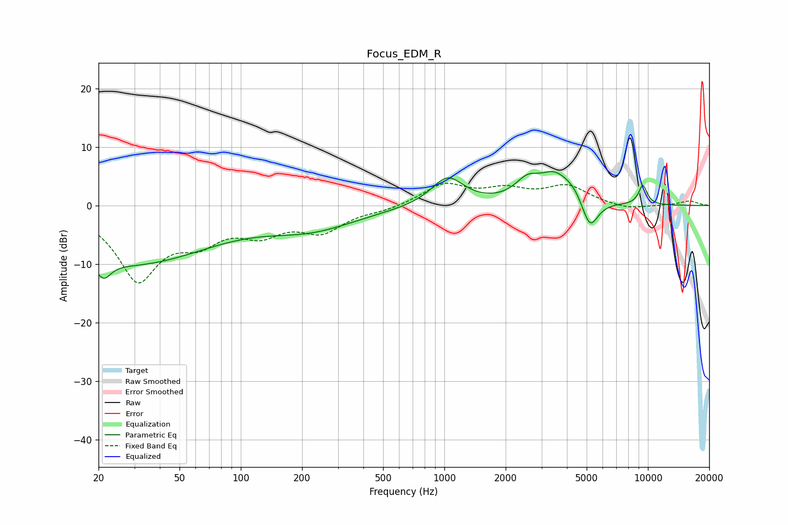

# Focus_EDM_R
See [usage instructions](https://github.com/jaakkopasanen/AutoEq#usage) for more options and info.

### Parametric EQs
Apply preamp of -5.9 dB when using parametric equalizer.

|   # | Type    |   Fc (Hz) |    Q |   Gain (dB) |
|-----|---------|-----------|------|-------------|
|   1 | Peaking |        21 | 4.14 |        -2.9 |
|   2 | Peaking |        24 | 0.31 |        -6.3 |
|   3 | Peaking |        33 | 0.41 |        -3.7 |
|   4 | Peaking |       221 | 0.62 |        -3.6 |
|   5 | Peaking |      1037 | 1.77 |         4.9 |
|   6 | Peaking |      2556 | 2.31 |         3.2 |
|   7 | Peaking |      3477 | 1.83 |         4.4 |
|   8 | Peaking |      4308 | 2.56 |         1.7 |
|   9 | Peaking |      5186 | 3.44 |        -5.3 |
|  10 | Peaking |      9444 | 5.72 |         3.3 |

### Fixed Band EQs
When using fixed band (also called graphic) equalizer, apply preamp of **-3.9 dB** (if available) and set gains manually with these parameters.

|   # | Type    |   Fc (Hz) |    Q |   Gain (dB) |
|-----|---------|-----------|------|-------------|
|   1 | Peaking |        31 | 1.41 |       -12.2 |
|   2 | Peaking |        62 | 1.41 |        -4.5 |
|   3 | Peaking |       125 | 1.41 |        -3.9 |
|   4 | Peaking |       250 | 1.41 |        -4   |
|   5 | Peaking |       500 | 1.41 |        -0.7 |
|   6 | Peaking |      1000 | 1.41 |         3.5 |
|   7 | Peaking |      2000 | 1.41 |         2.3 |
|   8 | Peaking |      4000 | 1.41 |         3.1 |
|   9 | Peaking |      8000 | 1.41 |        -0.8 |
|  10 | Peaking |     16000 | 1.41 |         0.8 |

### Graphs

