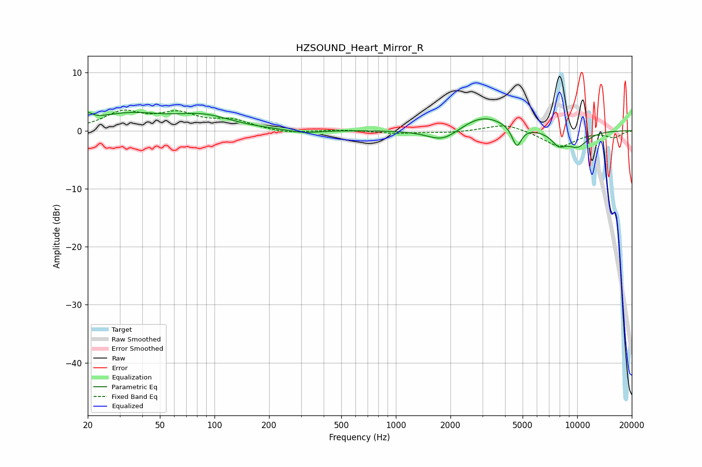

# HZSOUND_Heart_Mirror_R
See [usage instructions](https://github.com/jaakkopasanen/AutoEq#usage) for more options and info.

### Parametric EQs
Apply preamp of -3.2 dB when using parametric equalizer.

|   # | Type    |   Fc (Hz) |    Q |   Gain (dB) |
|-----|---------|-----------|------|-------------|
|   1 | Peaking |        20 | 5.73 |         1.2 |
|   2 | Peaking |        33 | 0.71 |         2.7 |
|   3 | Peaking |        87 | 0.91 |         2.1 |
|   4 | Peaking |       310 | 1.71 |        -0.6 |
|   5 | Peaking |      1850 | 1.57 |        -2.6 |
|   6 | Peaking |      1990 | 2.75 |         0.2 |
|   7 | Peaking |      2987 | 1.08 |         2.9 |
|   8 | Peaking |      4643 | 5.5  |        -3.5 |
|   9 | Peaking |      7905 | 3.22 |        -2   |
|  10 | Peaking |     10000 | 1.98 |        -2.6 |

### Fixed Band EQs
When using fixed band (also called graphic) equalizer, apply preamp of **-3.6 dB** (if available) and set gains manually with these parameters.

|   # | Type    |   Fc (Hz) |    Q |   Gain (dB) |
|-----|---------|-----------|------|-------------|
|   1 | Peaking |        31 | 1.41 |         3   |
|   2 | Peaking |        62 | 1.41 |         2.6 |
|   3 | Peaking |       125 | 1.41 |         1.6 |
|   4 | Peaking |       250 | 1.41 |        -0.5 |
|   5 | Peaking |       500 | 1.41 |         0.2 |
|   6 | Peaking |      1000 | 1.41 |        -0.5 |
|   7 | Peaking |      2000 | 1.41 |        -0.3 |
|   8 | Peaking |      4000 | 1.41 |         1.3 |
|   9 | Peaking |      8000 | 1.41 |        -2.8 |
|  10 | Peaking |     16000 | 1.41 |        -1.1 |

### Graphs

