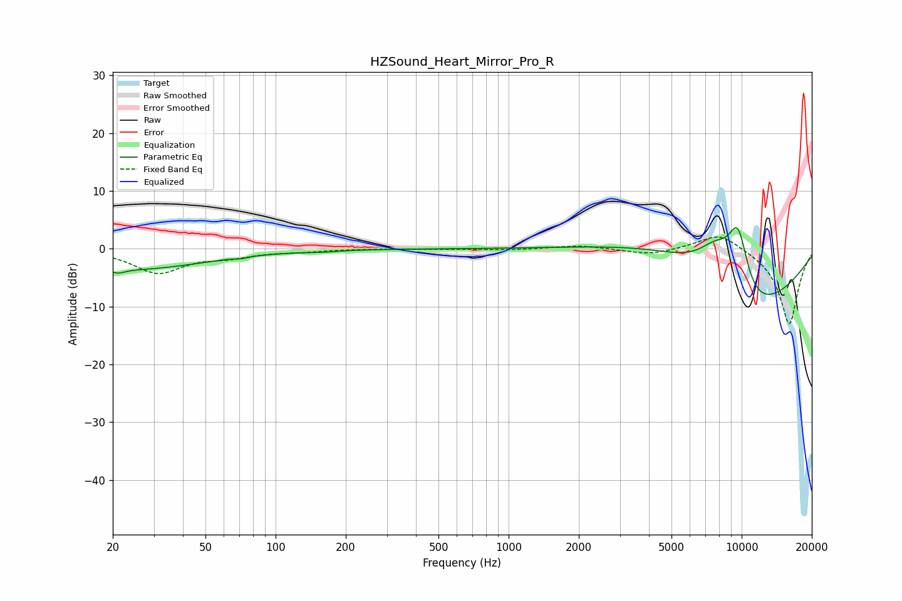

# HZSound_Heart_Mirror_Pro_R
See [usage instructions](https://github.com/jaakkopasanen/AutoEq#usage) for more options and info.

### Parametric EQs
Apply preamp of -3.8 dB when using parametric equalizer.

|   # | Type    |   Fc (Hz) |    Q |   Gain (dB) |
|-----|---------|-----------|------|-------------|
|   1 | Peaking |        21 | 4.46 |        -0.8 |
|   2 | Peaking |        24 | 0.45 |        -3.5 |
|   3 | Peaking |        41 | 4.16 |        -0   |
|   4 | Peaking |        71 | 5.9  |        -0.2 |
|   5 | Peaking |       157 | 2    |        -0.2 |
|   6 | Peaking |      5218 | 0.47 |         5.1 |
|   7 | Peaking |      7733 | 1.62 |         5.6 |
|   8 | Peaking |      9615 | 1.73 |        10.7 |
|   9 | Peaking |      9683 | 3.23 |         5.1 |
|  10 | Peaking |     10000 | 0.59 |       -18.7 |

### Fixed Band EQs
When using fixed band (also called graphic) equalizer, apply preamp of **-2.1 dB** (if available) and set gains manually with these parameters.

|   # | Type    |   Fc (Hz) |    Q |   Gain (dB) |
|-----|---------|-----------|------|-------------|
|   1 | Peaking |        31 | 1.41 |        -4.1 |
|   2 | Peaking |        62 | 1.41 |        -1.1 |
|   3 | Peaking |       125 | 1.41 |        -0.4 |
|   4 | Peaking |       250 | 1.41 |         0   |
|   5 | Peaking |       500 | 1.41 |        -0   |
|   6 | Peaking |      1000 | 1.41 |        -0.2 |
|   7 | Peaking |      2000 | 1.41 |         0.6 |
|   8 | Peaking |      4000 | 1.41 |        -1.1 |
|   9 | Peaking |      8000 | 1.41 |         3   |
|  10 | Peaking |     16000 | 1.41 |       -13.2 |

### Graphs

