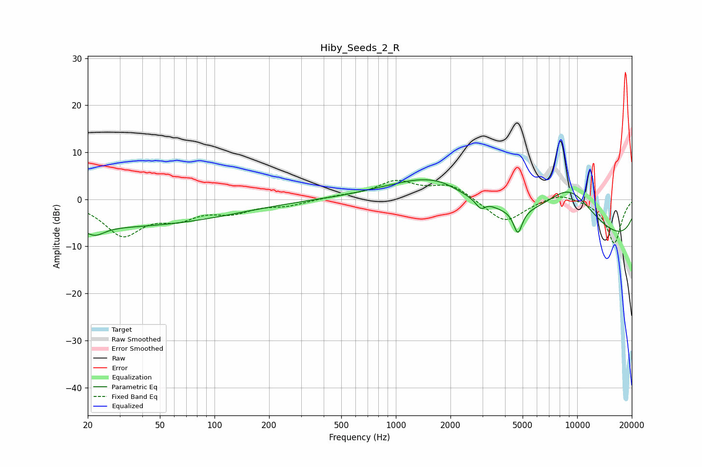

# Hiby_Seeds_2_R
See [usage instructions](https://github.com/jaakkopasanen/AutoEq#usage) for more options and info.

### Parametric EQs
Apply preamp of -4.3 dB when using parametric equalizer.

|   # | Type    |   Fc (Hz) |    Q |   Gain (dB) |
|-----|---------|-----------|------|-------------|
|   1 | Peaking |        22 | 2.84 |        -1.9 |
|   2 | Peaking |        25 | 0.18 |        -5.8 |
|   3 | Peaking |       760 | 2.04 |         0.1 |
|   4 | Peaking |      1628 | 0.6  |         7.8 |
|   5 | Peaking |      1819 | 3.9  |         0.1 |
|   6 | Peaking |      2962 | 4.24 |        -5.3 |
|   7 | Peaking |      2997 | 3.54 |         3.9 |
|   8 | Peaking |      4709 | 5.92 |        -5   |
|   9 | Peaking |      8982 | 0.63 |        13.9 |
|  10 | Peaking |     10000 | 0.18 |       -13   |

### Fixed Band EQs
When using fixed band (also called graphic) equalizer, apply preamp of **-4.1 dB** (if available) and set gains manually with these parameters.

|   # | Type    |   Fc (Hz) |    Q |   Gain (dB) |
|-----|---------|-----------|------|-------------|
|   1 | Peaking |        31 | 1.41 |        -7.3 |
|   2 | Peaking |        62 | 1.41 |        -3.2 |
|   3 | Peaking |       125 | 1.41 |        -2.4 |
|   4 | Peaking |       250 | 1.41 |        -1.1 |
|   5 | Peaking |       500 | 1.41 |         0.5 |
|   6 | Peaking |      1000 | 1.41 |         3.6 |
|   7 | Peaking |      2000 | 1.41 |         3.1 |
|   8 | Peaking |      4000 | 1.41 |        -5.1 |
|   9 | Peaking |      8000 | 1.41 |         1.7 |
|  10 | Peaking |     16000 | 1.41 |        -9.4 |

### Graphs

