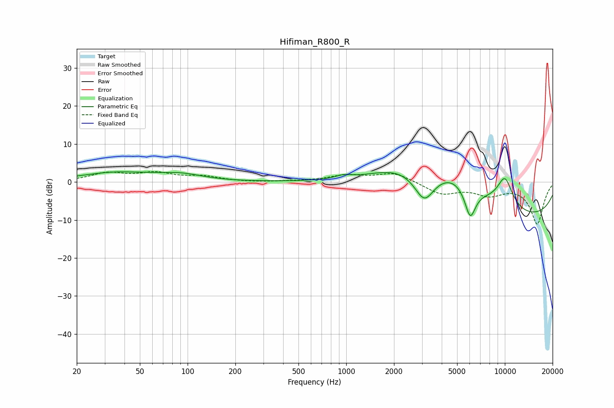

# Hifiman_R800_R
See [usage instructions](https://github.com/jaakkopasanen/AutoEq#usage) for more options and info.

### Parametric EQs
Apply preamp of -2.8 dB when using parametric equalizer.

|   # | Type    |   Fc (Hz) |    Q |   Gain (dB) |
|-----|---------|-----------|------|-------------|
|   1 | Peaking |        36 | 0.61 |         2.4 |
|   2 | Peaking |        43 | 3.19 |        -0.1 |
|   3 | Peaking |        92 | 1.07 |         1.5 |
|   4 | Peaking |       962 | 2.85 |         0.9 |
|   5 | Peaking |      2259 | 0.64 |         6.3 |
|   6 | Peaking |      3107 | 2.11 |        -8.1 |
|   7 | Peaking |      4774 | 0.69 |         8.7 |
|   8 | Peaking |      6048 | 3.77 |        -8.5 |
|   9 | Peaking |      9767 | 0.18 |       -10.4 |
|  10 | Peaking |     10000 | 2.34 |         8.2 |

### Fixed Band EQs
When using fixed band (also called graphic) equalizer, apply preamp of **-2.8 dB** (if available) and set gains manually with these parameters.

|   # | Type    |   Fc (Hz) |    Q |   Gain (dB) |
|-----|---------|-----------|------|-------------|
|   1 | Peaking |        31 | 1.41 |         2.2 |
|   2 | Peaking |        62 | 1.41 |         2.1 |
|   3 | Peaking |       125 | 1.41 |         1.3 |
|   4 | Peaking |       250 | 1.41 |        -0.1 |
|   5 | Peaking |       500 | 1.41 |         0.1 |
|   6 | Peaking |      1000 | 1.41 |         1.6 |
|   7 | Peaking |      2000 | 1.41 |         2.5 |
|   8 | Peaking |      4000 | 1.41 |        -3.1 |
|   9 | Peaking |      8000 | 1.41 |        -2.9 |
|  10 | Peaking |     16000 | 1.41 |       -11   |

### Graphs

