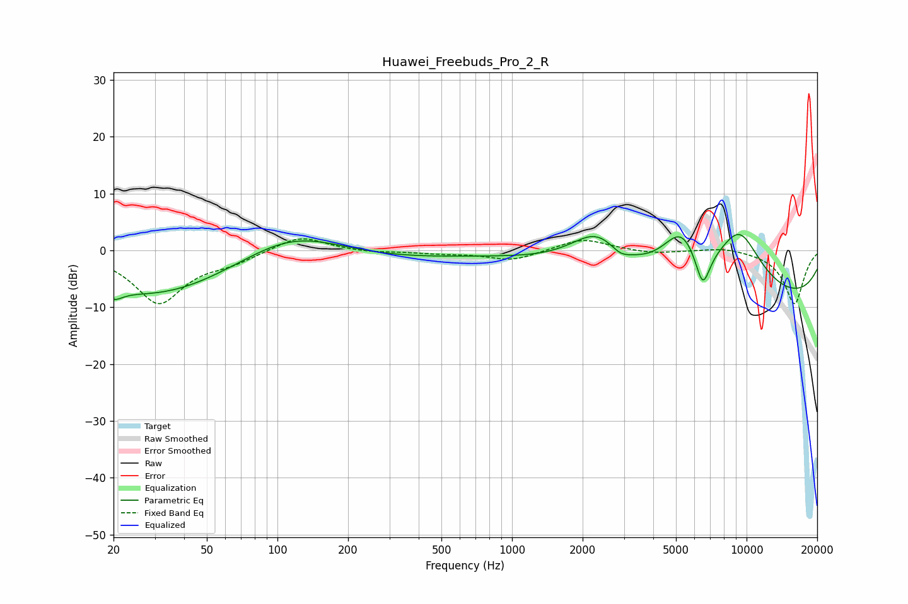

# Huawei_Freebuds_Pro_2_R
See [usage instructions](https://github.com/jaakkopasanen/AutoEq#usage) for more options and info.

### Parametric EQs
Apply preamp of -2.9 dB when using parametric equalizer.

|   # | Type    |   Fc (Hz) |    Q |   Gain (dB) |
|-----|---------|-----------|------|-------------|
|   1 | Peaking |        20 | 3.73 |        -1.9 |
|   2 | Peaking |        28 | 0.44 |        -5.7 |
|   3 | Peaking |        91 | 0.22 |        -4.4 |
|   4 | Peaking |       114 | 0.56 |         7.3 |
|   5 | Peaking |      2294 | 1.21 |         6.7 |
|   6 | Peaking |      2896 | 3.57 |        -1.3 |
|   7 | Peaking |      5257 | 1.59 |         8.3 |
|   8 | Peaking |      6500 | 4.16 |        -7   |
|   9 | Peaking |      9315 | 1.15 |        11.4 |
|  10 | Peaking |     10000 | 0.18 |        -9.8 |

### Fixed Band EQs
When using fixed band (also called graphic) equalizer, apply preamp of **-2.1 dB** (if available) and set gains manually with these parameters.

|   # | Type    |   Fc (Hz) |    Q |   Gain (dB) |
|-----|---------|-----------|------|-------------|
|   1 | Peaking |        31 | 1.41 |        -9.2 |
|   2 | Peaking |        62 | 1.41 |        -1.6 |
|   3 | Peaking |       125 | 1.41 |         2.8 |
|   4 | Peaking |       250 | 1.41 |        -0.4 |
|   5 | Peaking |       500 | 1.41 |        -0.5 |
|   6 | Peaking |      1000 | 1.41 |        -1.8 |
|   7 | Peaking |      2000 | 1.41 |         2.2 |
|   8 | Peaking |      4000 | 1.41 |        -0.6 |
|   9 | Peaking |      8000 | 1.41 |         0.7 |
|  10 | Peaking |     16000 | 1.41 |        -9.5 |

### Graphs

