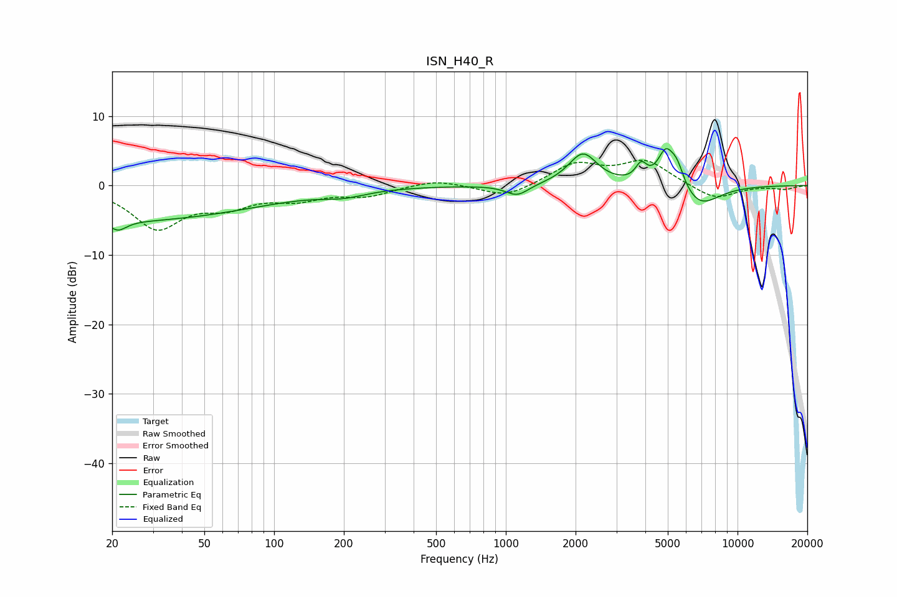

# ISN_H40_R
See [usage instructions](https://github.com/jaakkopasanen/AutoEq#usage) for more options and info.

### Parametric EQs
Apply preamp of -5.4 dB when using parametric equalizer.

|   # | Type    |   Fc (Hz) |    Q |   Gain (dB) |
|-----|---------|-----------|------|-------------|
|   1 | Peaking |        20 | 0.21 |        -5.1 |
|   2 | Peaking |        22 | 5.33 |        -3.8 |
|   3 | Peaking |        22 | 6    |         2.5 |
|   4 | Peaking |       200 | 1.47 |        -0.9 |
|   5 | Peaking |      1120 | 2.83 |        -1.6 |
|   6 | Peaking |      2151 | 2.28 |         4.6 |
|   7 | Peaking |      3841 | 5.71 |         2.4 |
|   8 | Peaking |      4896 | 3.91 |         4.7 |
|   9 | Peaking |      5482 | 4.39 |         3   |
|  10 | Peaking |      6840 | 1.6  |        -3.2 |

### Fixed Band EQs
When using fixed band (also called graphic) equalizer, apply preamp of **-3.7 dB** (if available) and set gains manually with these parameters.

|   # | Type    |   Fc (Hz) |    Q |   Gain (dB) |
|-----|---------|-----------|------|-------------|
|   1 | Peaking |        31 | 1.41 |        -5.9 |
|   2 | Peaking |        62 | 1.41 |        -2.4 |
|   3 | Peaking |       125 | 1.41 |        -1.7 |
|   4 | Peaking |       250 | 1.41 |        -1.4 |
|   5 | Peaking |       500 | 1.41 |         0.9 |
|   6 | Peaking |      1000 | 1.41 |        -1.8 |
|   7 | Peaking |      2000 | 1.41 |         3   |
|   8 | Peaking |      4000 | 1.41 |         3.4 |
|   9 | Peaking |      8000 | 1.41 |        -2.1 |
|  10 | Peaking |     16000 | 1.41 |        -0.5 |

### Graphs

