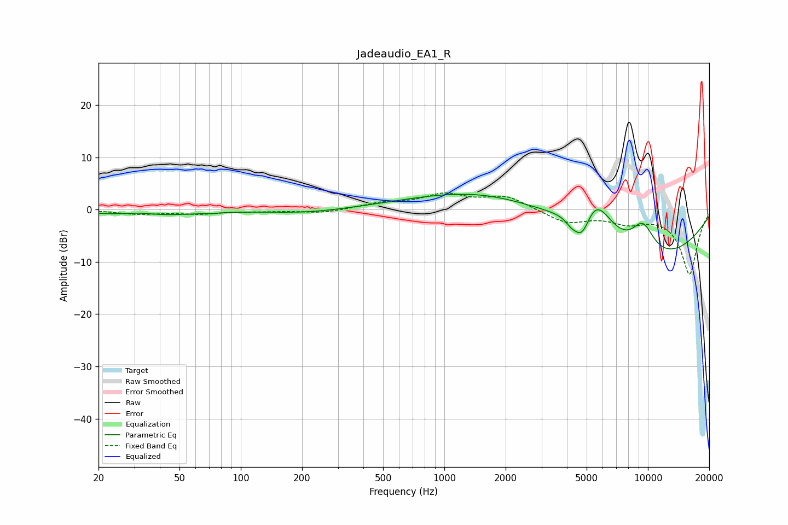

# Jadeaudio_EA1_R
See [usage instructions](https://github.com/jaakkopasanen/AutoEq#usage) for more options and info.

### Parametric EQs
Apply preamp of -3.0 dB when using parametric equalizer.

|   # | Type    |   Fc (Hz) |    Q |   Gain (dB) |
|-----|---------|-----------|------|-------------|
|   1 | Peaking |        32 | 1.56 |         0.9 |
|   2 | Peaking |        33 | 0.74 |        -1.6 |
|   3 | Peaking |        72 | 5.37 |        -0.2 |
|   4 | Peaking |       212 | 0.72 |        -0.8 |
|   5 | Peaking |      1924 | 0.39 |         6.8 |
|   6 | Peaking |      4172 | 5.95 |        -0.8 |
|   7 | Peaking |      4746 | 2.71 |        -7.5 |
|   8 | Peaking |      5427 | 1.14 |        14.8 |
|   9 | Peaking |      7232 | 0.32 |       -15.7 |
|  10 | Peaking |      9431 | 2.06 |         6.5 |

### Fixed Band EQs
When using fixed band (also called graphic) equalizer, apply preamp of **-3.3 dB** (if available) and set gains manually with these parameters.

|   # | Type    |   Fc (Hz) |    Q |   Gain (dB) |
|-----|---------|-----------|------|-------------|
|   1 | Peaking |        31 | 1.41 |        -0.8 |
|   2 | Peaking |        62 | 1.41 |        -0.7 |
|   3 | Peaking |       125 | 1.41 |        -0.2 |
|   4 | Peaking |       250 | 1.41 |        -0.7 |
|   5 | Peaking |       500 | 1.41 |         1.1 |
|   6 | Peaking |      1000 | 1.41 |         2.7 |
|   7 | Peaking |      2000 | 1.41 |         2.5 |
|   8 | Peaking |      4000 | 1.41 |        -2.5 |
|   9 | Peaking |      8000 | 1.41 |        -2.1 |
|  10 | Peaking |     16000 | 1.41 |       -12.3 |

### Graphs

