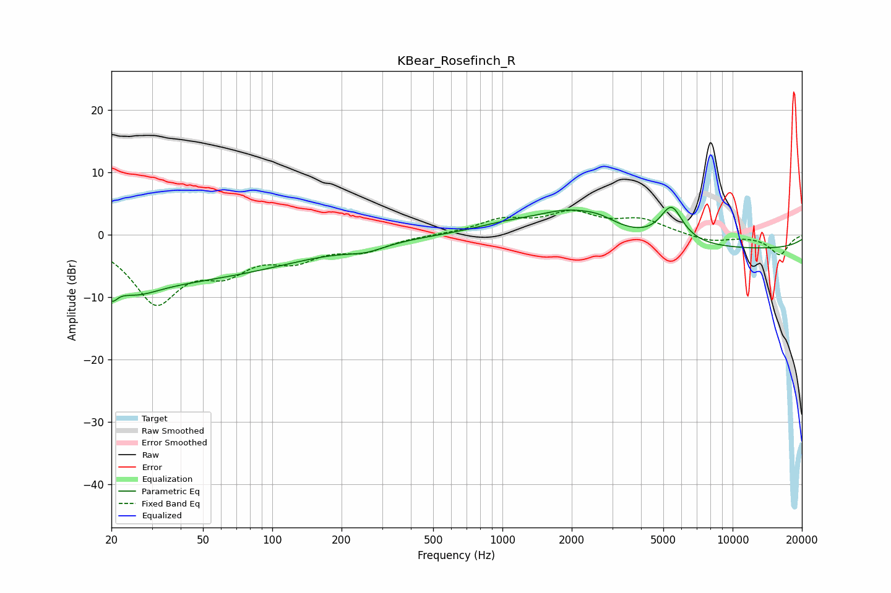

# KBear_Rosefinch_R
See [usage instructions](https://github.com/jaakkopasanen/AutoEq#usage) for more options and info.

### Parametric EQs
Apply preamp of -4.5 dB when using parametric equalizer.

|   # | Type    |   Fc (Hz) |    Q |   Gain (dB) |
|-----|---------|-----------|------|-------------|
|   1 | Peaking |        20 | 4.07 |         2.6 |
|   2 | Peaking |        20 | 5.12 |        -4.4 |
|   3 | Peaking |        25 | 1.4  |        -2   |
|   4 | Peaking |        26 | 0.19 |        -7.5 |
|   5 | Peaking |       255 | 1.6  |        -1.2 |
|   6 | Peaking |      1025 | 1.01 |         1.1 |
|   7 | Peaking |      1982 | 0.88 |         4.2 |
|   8 | Peaking |      2663 | 1.97 |         1   |
|   9 | Peaking |      5425 | 2.77 |         5.7 |
|  10 | Peaking |      9856 | 0.18 |        -2.3 |

### Fixed Band EQs
When using fixed band (also called graphic) equalizer, apply preamp of **-4.0 dB** (if available) and set gains manually with these parameters.

|   # | Type    |   Fc (Hz) |    Q |   Gain (dB) |
|-----|---------|-----------|------|-------------|
|   1 | Peaking |        31 | 1.41 |       -10.3 |
|   2 | Peaking |        62 | 1.41 |        -4.5 |
|   3 | Peaking |       125 | 1.41 |        -3.3 |
|   4 | Peaking |       250 | 1.41 |        -2.2 |
|   5 | Peaking |       500 | 1.41 |         0   |
|   6 | Peaking |      1000 | 1.41 |         2.2 |
|   7 | Peaking |      2000 | 1.41 |         3.2 |
|   8 | Peaking |      4000 | 1.41 |         2.2 |
|   9 | Peaking |      8000 | 1.41 |        -1.1 |
|  10 | Peaking |     16000 | 1.41 |        -3.2 |

### Graphs

