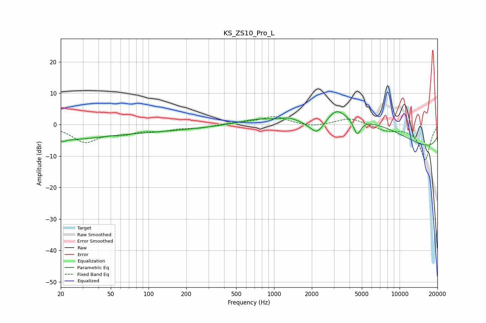

# KS_ZS10_Pro_L
See [usage instructions](https://github.com/jaakkopasanen/AutoEq#usage) for more options and info.

### Parametric EQs
Apply preamp of -4.2 dB when using parametric equalizer.

|   # | Type    |   Fc (Hz) |    Q |   Gain (dB) |
|-----|---------|-----------|------|-------------|
|   1 | Peaking |        21 | 6    |        -0.7 |
|   2 | Peaking |        21 | 0.52 |        -2.5 |
|   3 | Peaking |        48 | 0.18 |        -2.4 |
|   4 | Peaking |       728 | 1.04 |         1.3 |
|   5 | Peaking |      1314 | 2.31 |         0.9 |
|   6 | Peaking |      2198 | 2.3  |        -5   |
|   7 | Peaking |      3131 | 1.94 |         3.9 |
|   8 | Peaking |      4597 | 4.92 |        -5   |
|   9 | Peaking |      5542 | 0.29 |        12.1 |
|  10 | Peaking |      9914 | 0.18 |       -12.6 |

### Fixed Band EQs
When using fixed band (also called graphic) equalizer, apply preamp of **-2.6 dB** (if available) and set gains manually with these parameters.

|   # | Type    |   Fc (Hz) |    Q |   Gain (dB) |
|-----|---------|-----------|------|-------------|
|   1 | Peaking |        31 | 1.41 |        -5.2 |
|   2 | Peaking |        62 | 1.41 |        -2.3 |
|   3 | Peaking |       125 | 1.41 |        -1.5 |
|   4 | Peaking |       250 | 1.41 |        -0.9 |
|   5 | Peaking |       500 | 1.41 |         0.6 |
|   6 | Peaking |      1000 | 1.41 |         2.6 |
|   7 | Peaking |      2000 | 1.41 |        -0.9 |
|   8 | Peaking |      4000 | 1.41 |         2.2 |
|   9 | Peaking |      8000 | 1.41 |        -1.7 |
|  10 | Peaking |     16000 | 1.41 |       -11.2 |

### Graphs

