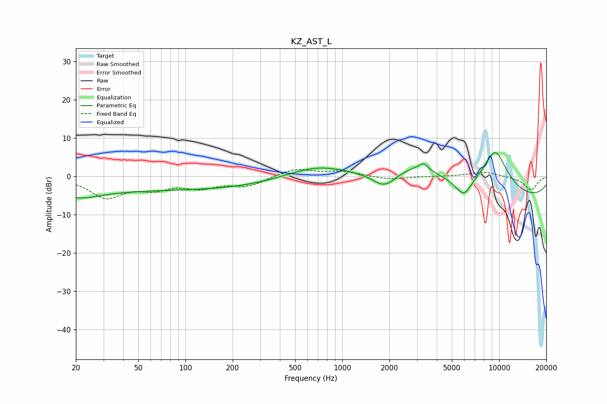

# KZ_AST_L
See [usage instructions](https://github.com/jaakkopasanen/AutoEq#usage) for more options and info.

### Parametric EQs
Apply preamp of -6.3 dB when using parametric equalizer.

|   # | Type    |   Fc (Hz) |    Q |   Gain (dB) |
|-----|---------|-----------|------|-------------|
|   1 | Peaking |        20 | 0.9  |        -3.6 |
|   2 | Peaking |        97 | 0.19 |        -3.5 |
|   3 | Peaking |       685 | 0.69 |         3.6 |
|   4 | Peaking |      1864 | 1.91 |        -3.9 |
|   5 | Peaking |      3013 | 0.83 |         5   |
|   6 | Peaking |      3283 | 4.88 |         1.7 |
|   7 | Peaking |      5147 | 0.33 |         1.7 |
|   8 | Peaking |      5947 | 2.69 |        -4.5 |
|   9 | Peaking |      9451 | 1.49 |        11.4 |
|  10 | Peaking |      9967 | 0.18 |        -6.6 |

### Fixed Band EQs
When using fixed band (also called graphic) equalizer, apply preamp of **-1.9 dB** (if available) and set gains manually with these parameters.

|   # | Type    |   Fc (Hz) |    Q |   Gain (dB) |
|-----|---------|-----------|------|-------------|
|   1 | Peaking |        31 | 1.41 |        -5.3 |
|   2 | Peaking |        62 | 1.41 |        -2.6 |
|   3 | Peaking |       125 | 1.41 |        -2.5 |
|   4 | Peaking |       250 | 1.41 |        -2.3 |
|   5 | Peaking |       500 | 1.41 |         2.1 |
|   6 | Peaking |      1000 | 1.41 |         1.3 |
|   7 | Peaking |      2000 | 1.41 |        -0.8 |
|   8 | Peaking |      4000 | 1.41 |        -0   |
|   9 | Peaking |      8000 | 1.41 |         1.2 |
|  10 | Peaking |     16000 | 1.41 |        -3.5 |

### Graphs

