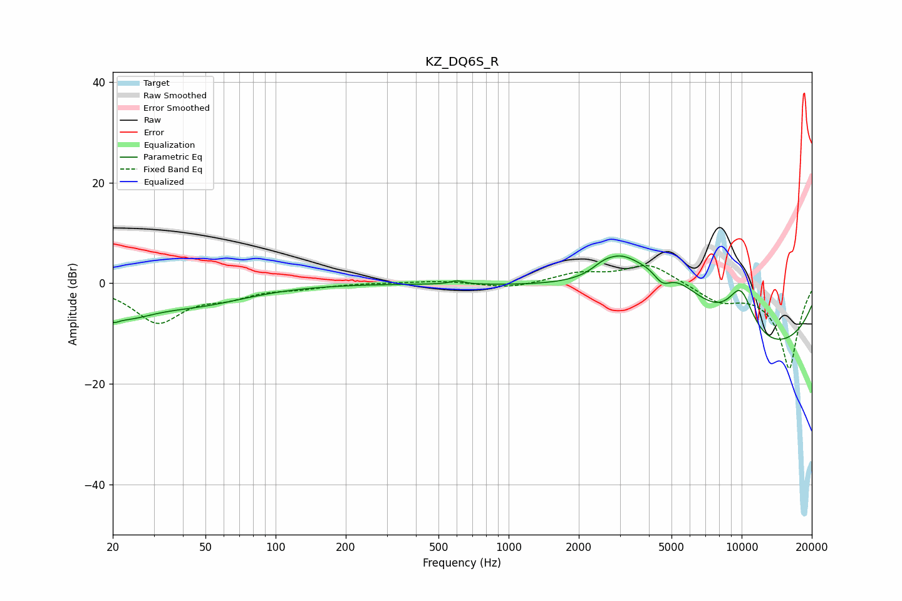

# KZ_DQ6S_R
See [usage instructions](https://github.com/jaakkopasanen/AutoEq#usage) for more options and info.

### Parametric EQs
Apply preamp of -5.5 dB when using parametric equalizer.

|   # | Type    |   Fc (Hz) |    Q |   Gain (dB) |
|-----|---------|-----------|------|-------------|
|   1 | Peaking |        20 | 6    |        -1.3 |
|   2 | Peaking |        22 | 1.01 |        -5.4 |
|   3 | Peaking |        48 | 0.66 |        -3.3 |
|   4 | Peaking |       601 | 5.23 |         0.7 |
|   5 | Peaking |      2542 | 2.83 |         1.4 |
|   6 | Peaking |      3014 | 1.9  |         3.5 |
|   7 | Peaking |      4566 | 3.46 |        -3.4 |
|   8 | Peaking |      4630 | 0.58 |        15   |
|   9 | Peaking |      9785 | 0.26 |       -18.4 |
|  10 | Peaking |      9899 | 1.85 |        10.5 |

### Fixed Band EQs
When using fixed band (also called graphic) equalizer, apply preamp of **-3.6 dB** (if available) and set gains manually with these parameters.

|   # | Type    |   Fc (Hz) |    Q |   Gain (dB) |
|-----|---------|-----------|------|-------------|
|   1 | Peaking |        31 | 1.41 |        -7.6 |
|   2 | Peaking |        62 | 1.41 |        -2.1 |
|   3 | Peaking |       125 | 1.41 |        -0.8 |
|   4 | Peaking |       250 | 1.41 |         0.1 |
|   5 | Peaking |       500 | 1.41 |         0.5 |
|   6 | Peaking |      1000 | 1.41 |        -1   |
|   7 | Peaking |      2000 | 1.41 |         1.9 |
|   8 | Peaking |      4000 | 1.41 |         3.9 |
|   9 | Peaking |      8000 | 1.41 |        -3.1 |
|  10 | Peaking |     16000 | 1.41 |       -16.9 |

### Graphs

