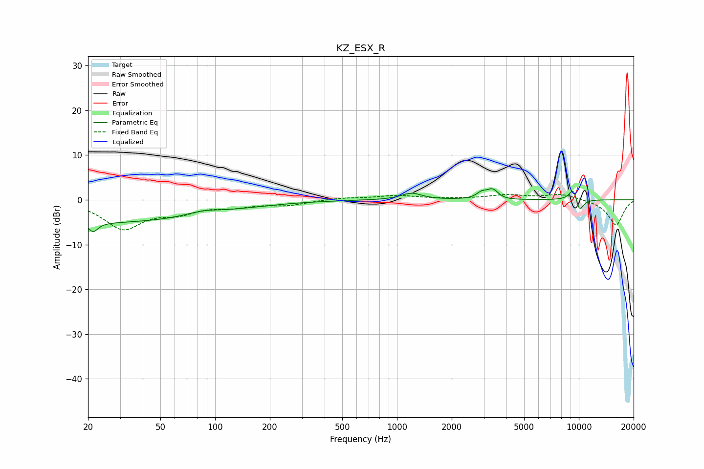

# KZ_ESX_R
See [usage instructions](https://github.com/jaakkopasanen/AutoEq#usage) for more options and info.

### Parametric EQs
Apply preamp of -2.6 dB when using parametric equalizer.

|   # | Type    |   Fc (Hz) |    Q |   Gain (dB) |
|-----|---------|-----------|------|-------------|
|   1 | Peaking |        21 | 5.6  |        -2   |
|   2 | Peaking |        22 | 0.18 |        -5.1 |
|   3 | Peaking |        86 | 1.47 |         1   |
|   4 | Peaking |      1202 | 2.5  |         1.5 |
|   5 | Peaking |      2923 | 5.06 |         1.3 |
|   6 | Peaking |      3362 | 4.49 |         2.2 |
|   7 | Peaking |      3771 | 2.44 |        -0.2 |
|   8 | Peaking |      9407 | 5    |         3.9 |
|   9 | Peaking |     10000 | 4.55 |        -2.2 |
|  10 | Peaking |     10000 | 5.62 |        -1.8 |

### Fixed Band EQs
When using fixed band (also called graphic) equalizer, apply preamp of **-1.3 dB** (if available) and set gains manually with these parameters.

|   # | Type    |   Fc (Hz) |    Q |   Gain (dB) |
|-----|---------|-----------|------|-------------|
|   1 | Peaking |        31 | 1.41 |        -6.2 |
|   2 | Peaking |        62 | 1.41 |        -2.4 |
|   3 | Peaking |       125 | 1.41 |        -1.2 |
|   4 | Peaking |       250 | 1.41 |        -1.1 |
|   5 | Peaking |       500 | 1.41 |         0.4 |
|   6 | Peaking |      1000 | 1.41 |         0.9 |
|   7 | Peaking |      2000 | 1.41 |         0.1 |
|   8 | Peaking |      4000 | 1.41 |         1   |
|   9 | Peaking |      8000 | 1.41 |         1.3 |
|  10 | Peaking |     16000 | 1.41 |        -5.7 |

### Graphs

