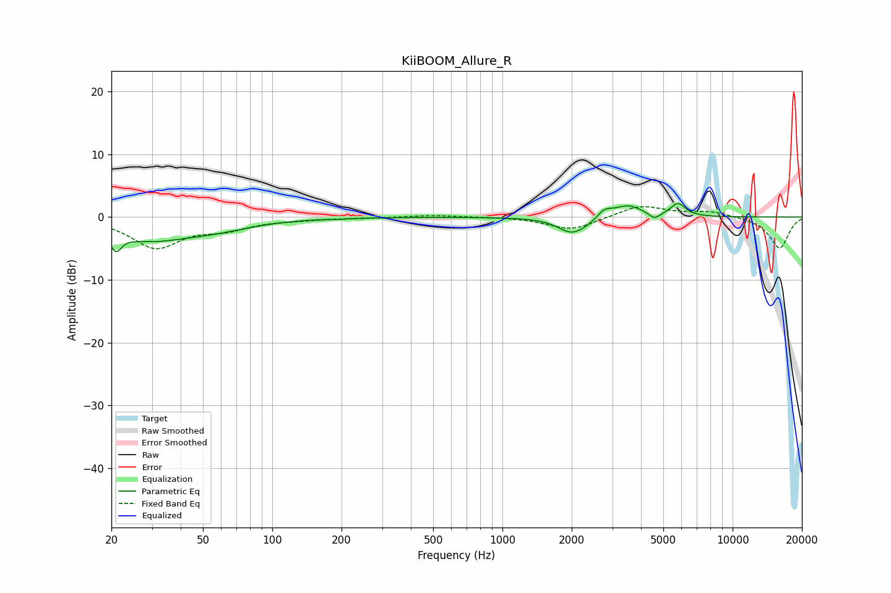

# KiiBOOM_Allure_R
See [usage instructions](https://github.com/jaakkopasanen/AutoEq#usage) for more options and info.

### Parametric EQs
Apply preamp of -2.3 dB when using parametric equalizer.

|   # | Type    |   Fc (Hz) |    Q |   Gain (dB) |
|-----|---------|-----------|------|-------------|
|   1 | Peaking |        21 | 5.99 |        -2.7 |
|   2 | Peaking |        29 | 0.82 |        -3.2 |
|   3 | Peaking |        57 | 0.86 |        -1.4 |
|   4 | Peaking |       193 | 5.99 |        -0.1 |
|   5 | Peaking |      1990 | 2.38 |        -2.3 |
|   6 | Peaking |      2371 | 2.22 |        -0.7 |
|   7 | Peaking |      2764 | 4.35 |         1.4 |
|   8 | Peaking |      3500 | 2.21 |         2   |
|   9 | Peaking |      4574 | 6    |        -1   |
|  10 | Peaking |      5791 | 4.35 |         2.1 |

### Fixed Band EQs
When using fixed band (also called graphic) equalizer, apply preamp of **-1.8 dB** (if available) and set gains manually with these parameters.

|   # | Type    |   Fc (Hz) |    Q |   Gain (dB) |
|-----|---------|-----------|------|-------------|
|   1 | Peaking |        31 | 1.41 |        -4.7 |
|   2 | Peaking |        62 | 1.41 |        -1.6 |
|   3 | Peaking |       125 | 1.41 |        -0.3 |
|   4 | Peaking |       250 | 1.41 |        -0.1 |
|   5 | Peaking |       500 | 1.41 |         0.3 |
|   6 | Peaking |      1000 | 1.41 |         0.1 |
|   7 | Peaking |      2000 | 1.41 |        -2.1 |
|   8 | Peaking |      4000 | 1.41 |         1.9 |
|   9 | Peaking |      8000 | 1.41 |         0.9 |
|  10 | Peaking |     16000 | 1.41 |        -5   |

### Graphs

