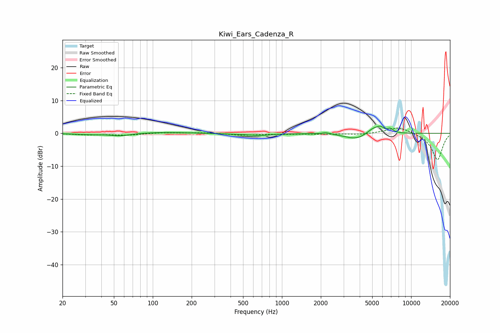

# Kiwi_Ears_Cadenza_R
See [usage instructions](https://github.com/jaakkopasanen/AutoEq#usage) for more options and info.

### Parametric EQs
Apply preamp of -2.3 dB when using parametric equalizer.

|   # | Type    |   Fc (Hz) |    Q |   Gain (dB) |
|-----|---------|-----------|------|-------------|
|   1 | Peaking |        32 | 1.44 |        -0.3 |
|   2 | Peaking |        56 | 1.81 |        -0.8 |
|   3 | Peaking |       124 | 0.77 |         0.4 |
|   4 | Peaking |       410 | 1.41 |        -0.2 |
|   5 | Peaking |       677 | 1.66 |        -0.6 |
|   6 | Peaking |      2195 | 4.56 |         0.5 |
|   7 | Peaking |      3754 | 1.66 |        -1.9 |
|   8 | Peaking |      5171 | 2.6  |         2.1 |
|   9 | Peaking |      5814 | 5.89 |         1.1 |
|  10 | Peaking |      6902 | 6    |         1.2 |

### Fixed Band EQs
When using fixed band (also called graphic) equalizer, apply preamp of **-1.7 dB** (if available) and set gains manually with these parameters.

|   # | Type    |   Fc (Hz) |    Q |   Gain (dB) |
|-----|---------|-----------|------|-------------|
|   1 | Peaking |        31 | 1.41 |        -0.4 |
|   2 | Peaking |        62 | 1.41 |        -0.5 |
|   3 | Peaking |       125 | 1.41 |         0.3 |
|   4 | Peaking |       250 | 1.41 |         0.2 |
|   5 | Peaking |       500 | 1.41 |        -0.5 |
|   6 | Peaking |      1000 | 1.41 |        -0.2 |
|   7 | Peaking |      2000 | 1.41 |        -0.2 |
|   8 | Peaking |      4000 | 1.41 |        -0.4 |
|   9 | Peaking |      8000 | 1.41 |         2.1 |
|  10 | Peaking |     16000 | 1.41 |        -8.1 |

### Graphs

