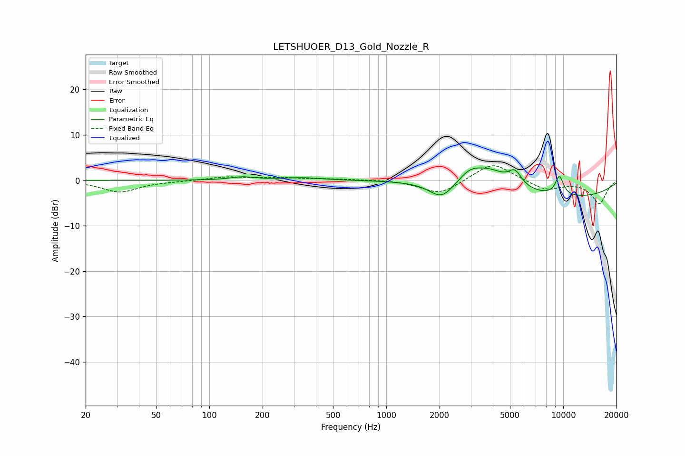

# LETSHUOER_D13_Gold_Nozzle_R
See [usage instructions](https://github.com/jaakkopasanen/AutoEq#usage) for more options and info.

### Parametric EQs
Apply preamp of -2.8 dB when using parametric equalizer.

|   # | Type    |   Fc (Hz) |    Q |   Gain (dB) |
|-----|---------|-----------|------|-------------|
|   1 | Peaking |       154 | 2.11 |         0.7 |
|   2 | Peaking |       333 | 1.25 |         0.6 |
|   3 | Peaking |      2055 | 2.06 |        -3.8 |
|   4 | Peaking |      2948 | 2.39 |         1.9 |
|   5 | Peaking |      3744 | 1.21 |         4.1 |
|   6 | Peaking |      3988 | 2.01 |         0.2 |
|   7 | Peaking |      5340 | 3.75 |         3.1 |
|   8 | Peaking |      9510 | 5.45 |         3.6 |
|   9 | Peaking |      9575 | 4.41 |         0.7 |
|  10 | Peaking |      9850 | 0.29 |        -3.9 |

### Fixed Band EQs
When using fixed band (also called graphic) equalizer, apply preamp of **-3.3 dB** (if available) and set gains manually with these parameters.

|   # | Type    |   Fc (Hz) |    Q |   Gain (dB) |
|-----|---------|-----------|------|-------------|
|   1 | Peaking |        31 | 1.41 |        -2.6 |
|   2 | Peaking |        62 | 1.41 |        -0.1 |
|   3 | Peaking |       125 | 1.41 |         0.7 |
|   4 | Peaking |       250 | 1.41 |         0.5 |
|   5 | Peaking |       500 | 1.41 |         0.3 |
|   6 | Peaking |      1000 | 1.41 |         0.2 |
|   7 | Peaking |      2000 | 1.41 |        -3.1 |
|   8 | Peaking |      4000 | 1.41 |         4.1 |
|   9 | Peaking |      8000 | 1.41 |        -2.1 |
|  10 | Peaking |     16000 | 1.41 |        -5.1 |

### Graphs

