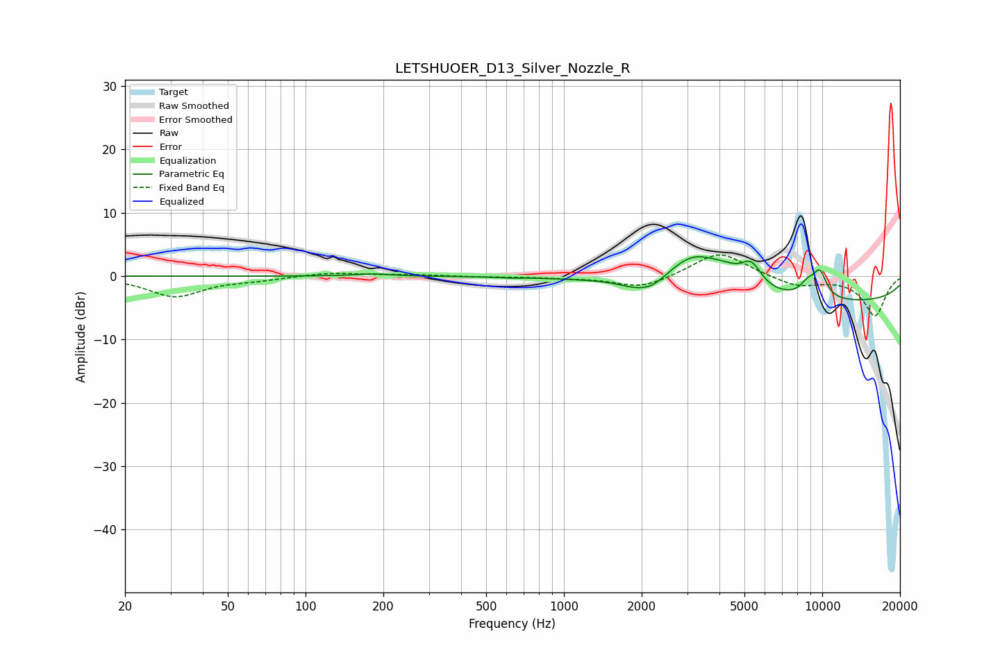

# LETSHUOER_D13_Silver_Nozzle_R
See [usage instructions](https://github.com/jaakkopasanen/AutoEq#usage) for more options and info.

### Parametric EQs
Apply preamp of -3.2 dB when using parametric equalizer.

|   # | Type    |   Fc (Hz) |    Q |   Gain (dB) |
|-----|---------|-----------|------|-------------|
|   1 | Peaking |       181 | 2.04 |         0.4 |
|   2 | Peaking |       609 | 4.08 |        -0.1 |
|   3 | Peaking |      1844 | 2.47 |        -0.8 |
|   4 | Peaking |      2186 | 2.5  |        -1.7 |
|   5 | Peaking |      3177 | 1.34 |         5.5 |
|   6 | Peaking |      4216 | 2.1  |         1.7 |
|   7 | Peaking |      5311 | 3.44 |         3.6 |
|   8 | Peaking |      8770 | 4.48 |         1.9 |
|   9 | Peaking |      9781 | 4.59 |         4.1 |
|  10 | Peaking |     10000 | 0.19 |        -4.2 |

### Fixed Band EQs
When using fixed band (also called graphic) equalizer, apply preamp of **-3.4 dB** (if available) and set gains manually with these parameters.

|   # | Type    |   Fc (Hz) |    Q |   Gain (dB) |
|-----|---------|-----------|------|-------------|
|   1 | Peaking |        31 | 1.41 |        -3.2 |
|   2 | Peaking |        62 | 1.41 |        -0.5 |
|   3 | Peaking |       125 | 1.41 |         0.6 |
|   4 | Peaking |       250 | 1.41 |         0.2 |
|   5 | Peaking |       500 | 1.41 |        -0.1 |
|   6 | Peaking |      1000 | 1.41 |        -0.2 |
|   7 | Peaking |      2000 | 1.41 |        -2   |
|   8 | Peaking |      4000 | 1.41 |         4   |
|   9 | Peaking |      8000 | 1.41 |        -1.6 |
|  10 | Peaking |     16000 | 1.41 |        -6.2 |

### Graphs

