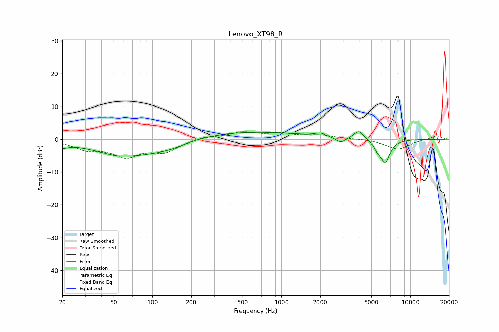

# Lenovo_XT98_R
See [usage instructions](https://github.com/jaakkopasanen/AutoEq#usage) for more options and info.

### Parametric EQs
Apply preamp of -2.4 dB when using parametric equalizer.

|   # | Type    |   Fc (Hz) |    Q |   Gain (dB) |
|-----|---------|-----------|------|-------------|
|   1 | Peaking |        20 | 3.74 |        -1.3 |
|   2 | Peaking |        52 | 3.61 |        -0.2 |
|   3 | Peaking |        64 | 0.55 |        -5   |
|   4 | Peaking |       137 | 1.05 |        -1.6 |
|   5 | Peaking |       510 | 0.3  |         2.4 |
|   6 | Peaking |      2003 | 3.31 |         1   |
|   7 | Peaking |      2886 | 3.92 |        -1.7 |
|   8 | Peaking |      3982 | 3.75 |         2.6 |
|   9 | Peaking |      5519 | 5.54 |        -1.8 |
|  10 | Peaking |      6382 | 3.76 |        -7.1 |

### Fixed Band EQs
When using fixed band (also called graphic) equalizer, apply preamp of **-2.4 dB** (if available) and set gains manually with these parameters.

|   # | Type    |   Fc (Hz) |    Q |   Gain (dB) |
|-----|---------|-----------|------|-------------|
|   1 | Peaking |        31 | 1.41 |        -2.8 |
|   2 | Peaking |        62 | 1.41 |        -4.7 |
|   3 | Peaking |       125 | 1.41 |        -3.5 |
|   4 | Peaking |       250 | 1.41 |         0.9 |
|   5 | Peaking |       500 | 1.41 |         2   |
|   6 | Peaking |      1000 | 1.41 |         1.5 |
|   7 | Peaking |      2000 | 1.41 |         1.1 |
|   8 | Peaking |      4000 | 1.41 |         0.1 |
|   9 | Peaking |      8000 | 1.41 |        -3.1 |
|  10 | Peaking |     16000 | 1.41 |         1.2 |

### Graphs

