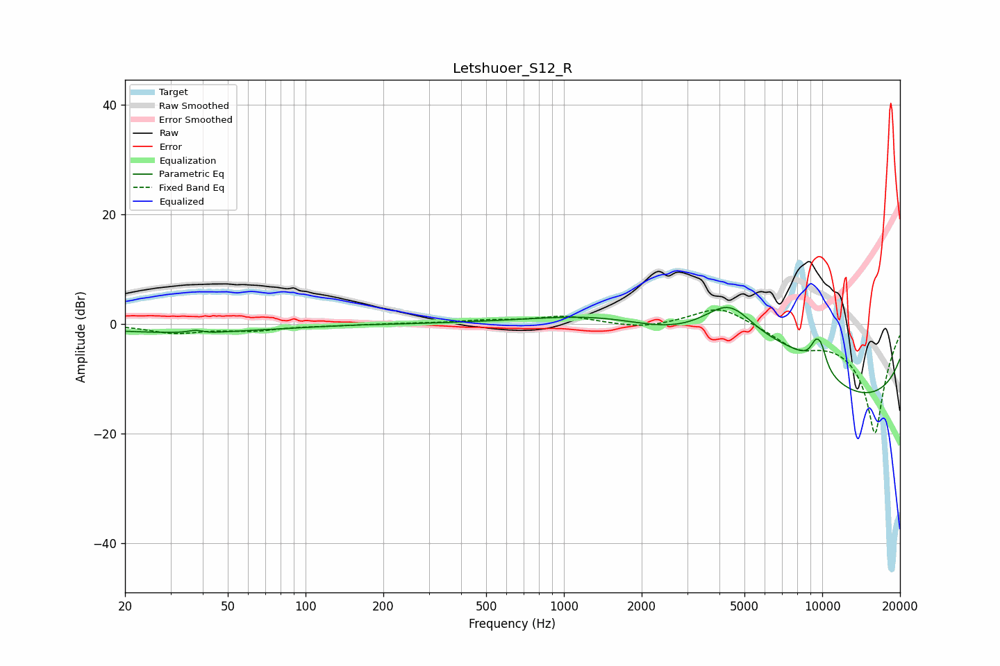

# Letshuoer_S12_R
See [usage instructions](https://github.com/jaakkopasanen/AutoEq#usage) for more options and info.

### Parametric EQs
Apply preamp of -3.1 dB when using parametric equalizer.

|   # | Type    |   Fc (Hz) |    Q |   Gain (dB) |
|-----|---------|-----------|------|-------------|
|   1 | Peaking |        32 | 0.4  |        -1.5 |
|   2 | Peaking |        38 | 5.11 |         0.6 |
|   3 | Peaking |        40 | 2.43 |        -0.3 |
|   4 | Peaking |       156 | 3.38 |         0.1 |
|   5 | Peaking |      1541 | 0.52 |         5.2 |
|   6 | Peaking |      4362 | 1.11 |        10.3 |
|   7 | Peaking |      8156 | 0.6  |        10.1 |
|   8 | Peaking |      9431 | 5.78 |         3.1 |
|   9 | Peaking |      9916 | 5.9  |         3.2 |
|  10 | Peaking |     10000 | 0.21 |       -19.6 |

### Fixed Band EQs
When using fixed band (also called graphic) equalizer, apply preamp of **-2.7 dB** (if available) and set gains manually with these parameters.

|   # | Type    |   Fc (Hz) |    Q |   Gain (dB) |
|-----|---------|-----------|------|-------------|
|   1 | Peaking |        31 | 1.41 |        -1.6 |
|   2 | Peaking |        62 | 1.41 |        -1.1 |
|   3 | Peaking |       125 | 1.41 |        -0.2 |
|   4 | Peaking |       250 | 1.41 |         0.1 |
|   5 | Peaking |       500 | 1.41 |         0.5 |
|   6 | Peaking |      1000 | 1.41 |         1.4 |
|   7 | Peaking |      2000 | 1.41 |        -0.9 |
|   8 | Peaking |      4000 | 1.41 |         3.5 |
|   9 | Peaking |      8000 | 1.41 |        -3.4 |
|  10 | Peaking |     16000 | 1.41 |       -20   |

### Graphs

